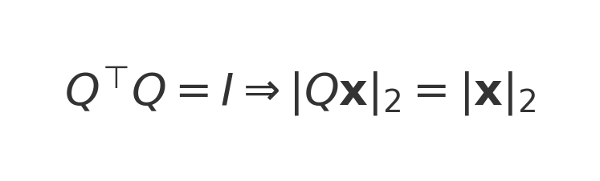

# Mathematics for Machine Learning — Comprehensive Notes

> A deep-dive, exam-ready reference that unfolds the “Mathematics for Machine Learning” chapter into detailed explanations, derivations, examples, NumPy snippets, and practical tips. Focus areas are **Linear Algebra Essentials** and **Norms, Inner Products, and Inequalities**, followed by concise but complete definitions of **Eigenvalues/Eigenvectors**, **SVD**, **Pseudoinverse**, **Jacobian**, **Hessian**, and related shapes you’ll use every day as an AI engineer.

---

## Table of Contents

1. Linear Algebra Essentials  
   1.1 Vectors, matrices, tensors, and shapes  
   1.2 Matrix operations (add, scalar, matmul)  
   1.3 Special matrices (identity, diagonal, symmetric, orthogonal)  
   1.4 Rank, range, null space, linear independence  
   1.5 Determinant and invertibility  
   1.6 Numerical issues: conditioning, scaling
2. Norms, Inner Products, and Inequalities  
   2.1 Vector norms (ℓ₀, ℓ₁, ℓ₂, ℓ∞) and when to use them  
   2.2 Matrix norms (Frobenius, spectral)  
   2.3 Inner products, cosine similarity  
   2.4 Cauchy–Schwarz, triangle inequality, Hölder & Minkowski
3. Eigenvalues & Eigenvectors — definition, intuition, uses
4. Singular Value Decomposition (SVD) — definition, properties, low-rank
5. Moore–Penrose Pseudoinverse — definition, least squares, SVD link
6. Matrix Calculus Cheat Sheet — Jacobian, gradient, Hessian (with shapes)
7. Worked Example — Linear regression: closed form, gradient descent, ridge
8. Quick Reference — “what to use when” for interviews & projects

---

## 1) Linear Algebra Essentials

### 1.1 Vectors, matrices, tensors, and shapes

- **Vector**: ordered list of numbers, an element of $\mathbb{R}^n$. Shape: `(n,)` or `(n,1)`.
- **Matrix**: rectangular array in $\mathbb{R}^{m\times n}$. Acts as a linear map $A: \mathbb{R}^n \to \mathbb{R}^m$.  
  
- **Tensor**: multi-dimensional array; in ML, usually order-3+ arrays (e.g., images as `H×W×C`).

**NumPy toy example**
```python
import numpy as np
x = np.array([1., 2., 3.])         # shape (3,)
A = np.array([[1., 0., -1.],
              [2., 1.,  0.]])      # shape (2,3)
y = A @ x                          # shape (2,)
```

---

### 1.2 Matrix operations (add, scalar, matmul)

- **Addition / Scalar**: Element-wise, same shape requirement.  
- **Matrix multiplication**: `(m×n)·(n×p) -> (m×p)`. Not commutative but associative.  
  Element formula:  
  

**Dot product (vector)**: $\mathbf{a}^\top \mathbf{b}$ equals the Euclidean inner product; $\|\mathbf{a}\|_2^2 = \mathbf{a}^\top\mathbf{a}$.

---

### 1.3 Special matrices

- **Identity $I$**: $I\mathbf{x}=\mathbf{x}$.
- **Diagonal $D$**: $D_{ij}=0$ for $i\neq j$; easy to invert if diagonal entries nonzero.
- **Symmetric $A=A^\top$**: real eigenvalues; orthogonal eigenvectors.
- **Orthogonal $Q^\top Q=I$**: length-preserving transforms (rotations/reflections).  
  

**Why you care**: Orthogonal/Unitary transforms (Fourier, PCA bases) preserve energy; helpful for stable optimization and conditioning.

---

### 1.4 Rank, range, null space, linear independence

- **Rank**: dimension of the column space (number of independent columns).  
- **Range (column space)**: all vectors $A\mathbf{x}$ you can reach.  
- **Null space**: all vectors $\mathbf{x}$ with $A\mathbf{x}=\mathbf{0}$.  
- **Rank–nullity** (for $A\in\mathbb{R}^{m\times n}$):  
  

**ML motivation**: Rank tells you if features are redundant; low rank ⇒ compressible data ⇒ PCA/low-rank models.

---

### 1.5 Determinant and invertibility

- **Determinant** measures volume scaling for square $A$. $\det(A)=0$ ⇒ singular (not invertible).  
- **Invertibility**: $A^{-1}$ satisfies $AA^{-1}=I$. Equivalent condition:  
  

**Geometric picture**: In $\mathbb{R}^2$, $|\det(A)|$ is the area scale factor of a transformed unit square.

---

### 1.6 Numerical issues: conditioning & scaling

- **Condition number** gauges sensitivity. Large $\kappa$ ⇒ tiny data noise causes large solution errors.  
  
- **Best practice**: center/standardize features; avoid explicitly computing matrix inverses; prefer factorizations (QR/SVD/Cholesky).

---

## 2) Norms, Inner Products, and Inequalities

### 2.1 Vector norms (how we measure size)

A **norm** $\|\cdot\|$ maps vectors to nonnegative scalars and satisfies positivity, homogeneity, and triangle inequality.

Common vector norms:

- **$\ell_2$ (Euclidean)**: $\|\mathbf{x}\|_2=\sqrt{\sum_i x_i^2}$. Smooth; rotationally invariant.  
- **$\ell_1$**: $\|\mathbf{x}\|_1=\sum_i |x_i|$. Promotes sparsity (Lasso).  
- **$\ell_\infty$**: $\|\mathbf{x}\|_\infty=\max_i |x_i|$. Useful for worst-case bounds.  
- **$\ell_0$** (not a true norm): counts nonzeros; used conceptually in sparsity.

General $p$-norm:  


**Choosing norms in ML**  
- Use $\ell_2$ in smooth optimization & Gaussian noise models.  
- Use $\ell_1$ when you want feature selection (sparsity).  
- Use $\ell_\infty$ for robust, adversarial, or max-error constraints.

---

### 2.2 Matrix norms

- **Frobenius**: element-wise energy.  
- **Spectral / operator (induced by $\ell_2$)**: largest singular value.  
  

**Tips**: Use $\|\cdot\|_F$ for easy, element-wise energy; use $\|\cdot\|_2$ when operator amplification matters (stability).

---

### 2.3 Inner products and cosine similarity

Angle-based similarity used in embeddings:  


---

### 2.4 Inequalities you’ll actually use

- **Cauchy–Schwarz**:  
  
```
|\mathbf{a}^\top\mathbf{b}|\le \|\mathbf{a}\|_2\|\mathbf{b}\|_2
```

- **Triangle inequality**: $\|\mathbf{a}+\mathbf{b}\|\le \|\mathbf{a}\|+\|\mathbf{b}\|$.  
- **Hölder**: $\sum_i |a_i b_i| \le \|\mathbf{a}\|_p\|\mathbf{b}\|_q$ with $1/p+1/q=1$.  
- **Minkowski**: $\|\mathbf{a}+\mathbf{b}\|_p \le \|\mathbf{a}\|_p+\|\mathbf{b}\|_p$.

---

## 3) Eigenvalues & Eigenvectors (definition, purpose, intuition)

Definition:  


Why useful: spectral theorem (symmetric matrices), PCA, graph Laplacians, power iteration.

---

## 4) Singular Value Decomposition (SVD)

Works for any $m\times n$ matrix:  
 with descending singular values.

Low-rank approximation (Eckart–Young):  


PCA via SVD: principal directions in $V$, variances in $\Sigma^2/(n-1)$.

---

## 5) Moore–Penrose Pseudoinverse

Via SVD:  


Least squares: $\hat{\mathbf{x}}=A^+\mathbf{b}$ for over/under-determined systems.

---

## 6) Matrix Calculus Cheat Sheet — Jacobian, Gradient, Hessian (with shapes)

- Jacobian:  
  
- Hessian:  
  

Chain rule:  


Least-squares gradient (and $H=A^\top A$):  


---

## 7) Worked Example — Linear Regression (closed form, GD, ridge)

Objective, gradients, and ridge closed form:  


**NumPy template**
```python
import numpy as np

n, d = 100, 5
X = np.random.randn(n, d)
true_w = np.array([1.0, -2.0, 0.5, 0.0, 3.0])
y = X @ true_w + 0.1*np.random.randn(n)

# Closed form via solve (more stable than explicit inverse)
w_hat = np.linalg.solve(X.T @ X, X.T @ y)

# Ridge
lam = 1e-2
w_ridge = np.linalg.solve(X.T @ X + n*lam*np.eye(d), X.T @ y)

# Gradient Descent
w = np.zeros(d)
eta = 1e-2
for _ in range(2000):
    grad = (X.T @ (X @ w - y)) / n
    w -= eta * grad
```

---

## 8) Quick definitions & interview-ready notes

- Eigenvalues/Eigenvectors: axes & scaling; PCA/stability.  
- SVD: universal, stable; compression; pseudoinverse; PCA.  
- Pseudoinverse: least-squares for rectangular/rank-deficient systems.  
- Jacobian: linearization/backprop; Hessian: curvature/Newton.

---

### Sources & Further Reading
- Gilbert Strang — *Linear Algebra and Learning from Data*  
- Boyd & Vandenberghe — *Convex Optimization* (free PDF)  
- Goodfellow, Bengio, Courville — *Deep Learning* (MIT Press, free online)  
- Murphy — *Probabilistic Machine Learning*  
- Petersen & Pedersen — *The Matrix Cookbook* (free PDF)

---

## Practical Examples (Hands-on)

### Matrix multiplication & associativity
Let
```
A = [[1, 2],
     [0, 1]]
B = [[ 2, 0],
     [-1, 3]]
C = [[1, 1],
     [4, 0]]
```
Then
```
A @ (B @ C) = [[24, 0], [11, -1]]
(A @ B) @ C = [[24, 0], [11, -1]]
```
They are equal, illustrating associativity.

### Orthogonal matrix (rotation)
45° rotation matrix \(Q\) satisfies \(Q^\top Q \approx I\):
```
Q^T Q ≈
[[1.0, 0.0], [0.0, 1.0]]
```

### Rank & null space
For
```
M = [[1, 2, 3],
     [2, 4, 6]]
```
```
rank(M) = 1
nullspace basis ≈ [[-2, 1, 0], [-3, 0, 1]]
```
(check: each basis vector v satisfies M @ v = 0).

### Determinant & area scaling
For
```
A = [[2, 0],
     [1, 3]]
det(A) = 6.0
```
A unit square’s area scales by |det(A)| = 6.0.

### Ill-conditioning demo
Let
```
A = [[1, 1],
     [1, 1+ε]],  ε = 0.0001
cond_2(A) ≈ 4.0e+04
```
Two nearby right-hand sides give very different solutions:
```
x(b=[2, 2+ε]) = [1.0, 1.0]
x(b=[2, 2-ε]) = [3.0, -1.0]
Δx = [2.0, -2.0]
```

### Vector norms
For v = [3.0, -4.0, 0.0, 12.0]:
```
||v||_1 = 19.0
||v||_2 = 13.0000
||v||_∞ = 12.0
```

### Cosine similarity
For a = [1.0, 2.0, 3.0], b = [-1.0, 0.0, 1.0]:
```
cosθ = 0.377964
Cauchy–Schwarz: |a·b| = 2.000000 ≤ ||a||·||b|| = 5.291503
Triangle: ||a+b|| = 4.472136 ≤ ||a|| + ||b|| = 5.155871
```

### Eigenvalues & eigenvectors (symmetric)
For
```
A = [[2, 1],
     [1, 2]]
```
```
eigenvalues = [3.0, 1.0]
eigenvectors (columns) ≈
[[0.707107, -0.707107], [0.707107, 0.707107]]
```

### SVD (tiny 2×2)
For
```
T = [[3, 1],
     [1, 3]]
```
```
U ≈ [[-0.707107, -0.707107], [-0.707107, 0.707107]]
S ≈ [4.0, 2.0]
V^T ≈ [[-0.707107, -0.707107], [-0.707107, 0.707107]]
```

### Pseudoinverse for least squares
Solve min_x ||Ax - b||_2 with
```
A = [[1,0],
     [1,1],
     [1,2]],  b = [1, 2, 2]
x* = [1.166667, 0.5]
MSE = 0.055556
```

### Jacobian & Hessian at (x,y)=(1,2)
For f(x,y) = [x^2, x y] and g(x,y) = x^2 + x y + y^2:
```
J_f(1,2) =
[[2.0, 0.0], [2.0, 1.0]]
∇g(1,2) = [4.0, 5.0]
H_g = 
[[2.0, 1.0], [1.0, 2.0]]
```

---

## Sources & Links (Official/Authoritative)

- Boyd & Vandenberghe — *Convex Optimization* (free PDF, Stanford) — https://web.stanford.edu/~boyd/cvxbook/bv_cvxbook.pdf
- Convex Optimization homepage (slides, extras) — https://stanford.edu/~boyd/cvxbook/
- Petersen & Pedersen — *The Matrix Cookbook* (DTU) — https://www2.compute.dtu.dk/pubdb/pubs/3274-full.html
- The Matrix Cookbook (Waterloo mirror PDF) — https://www.math.uwaterloo.ca/~hwolkowi/matrixcookbook.pdf
- Goodfellow, Bengio, Courville — *Deep Learning* (free online) — https://www.deeplearningbook.org/
- MIT OCW 18.06 Linear Algebra (Strang) — https://ocw.mit.edu/courses/18-06-linear-algebra-spring-2010/
- MIT OCW 18.06SC (self-paced) — https://ocw.mit.edu/courses/18-06sc-linear-algebra-fall-2011/
- Murphy — *Probabilistic Machine Learning* (series site) — https://probml.github.io/pml-book/
- Murphy — *Probabilistic Machine Learning: An Introduction* (MIT Press) — https://mitpress.mit.edu/9780262046824/probabilistic-machine-learning/
