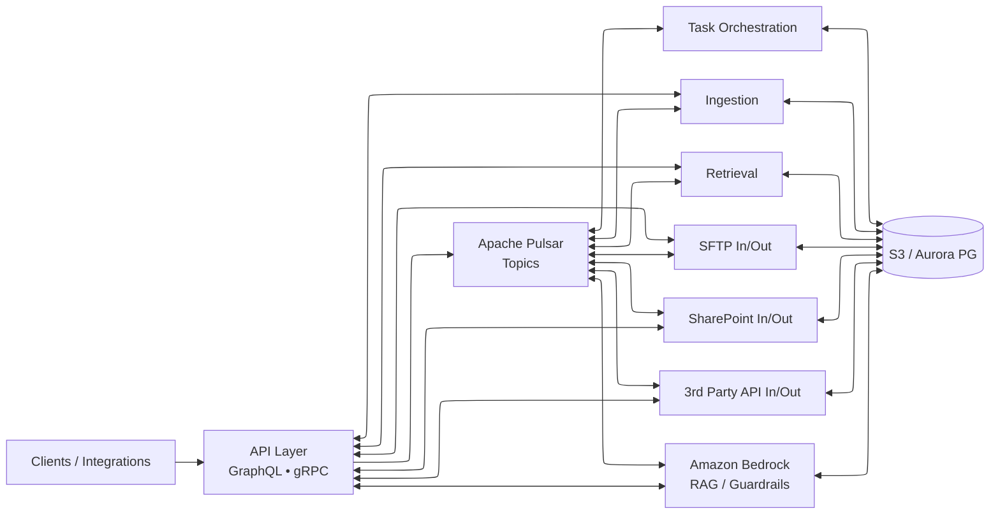

# Storage Hub — One-Pager
**Principal Solutions Architect (AI/Platform)**  
**Architect & Builder:** Andre Vepreve

---

## Overview
**Storage Hub** is an event-driven, AI-ready document and content platform built on **AWS**. It provides secure multi-tenant file operations, granular permissions, and decoupled workflows—enabling **RAG/agentic** patterns with **Amazon Bedrock** while meeting financial-grade reliability and compliance.

---

## Core Capabilities
- **Secure multi-tenant storage & metadata** — S3 (per tenant), Aurora PostgreSQL, fine-grained permissions, full auditing.
- **Event-driven workflows** — **Apache Pulsar** decouples slow/background jobs from interactive traffic.
- **External channels** — **SFTP In/Out**, **SharePoint In/Out**, and **3rd Party API In/Out** for ingestion and distribution.
- **AI enablement** — Retrieval patterns, prompt/guardrails, and agentic flows via **Amazon Bedrock**.
- **API surface** — **GraphQL** & **gRPC** for internal/external consumers; secure M2M (**OIDC/JWT**) authorization.

---

## Logical Flow (updated)

---

## Reference Architecture (Stack)
- **AWS:** **EKS** (IRSA, autoscaling), **S3**, **Aurora PostgreSQL Serverless**, Lambda, EventBridge/SQS (where applicable).
- **Runtime:** **NestJS/TypeScript** microservices; GraphQL/gRPC; Docker/Helm; **GitHub Actions** CI/CD.
- **Messaging:** **Apache Pulsar** topics for ingestion, enrichment, notifications, and task orchestration.
- **Security:** OIDC/JWT M2M auth; RBAC/ABAC; audit trails & evidence capture.
- **Observability:** **Prometheus**, **Grafana**, **Loki**; SLOs, runbooks, and alerting.

---

## Outcomes & Impact
- **Resilience & scale:** Event-driven design reduces coupling and smooths spikes under heavy workloads.
- **Delivery speed:** Standardized contracts (GraphQL/gRPC) + CI/CD accelerate features and reduce risk.
- **Compliance posture:** End-to-end auditability and least-privilege access aligned to enterprise controls.
- **Cost efficiency:** Right-sized serverless data stores and autoscaling policies lower TCO while meeting SLAs.

---

## Quick Facts
- **Primary role:** Architect & Builder (Andre Vepreve) — **Principal Solutions Architect (AI/Platform)**
- **Primary tech:** AWS **EKS**, **Amazon Bedrock**, **Apache Pulsar**, **Aurora PostgreSQL**, **S3**, **NestJS/TypeScript**, GraphQL/gRPC
- **Ops:** **Terraform** IaC, **GitHub Actions** CI/CD, **Prometheus/Grafna + Loki**

---

**Contact:** Andre Vepreve · Principal Solutions Architect (AI/Platform)
