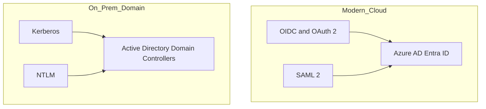
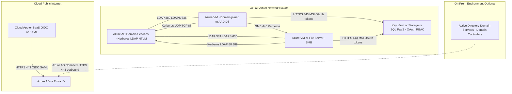

Awesome — here’s a single, clean guide that **combines everything** you asked for, with **Mermaid diagrams that avoid parentheses** so they render everywhere.

---

# Identity protocols in a nutshell

## Modern federation for web and cloud

**OIDC** and **SAML** enable SSO via an external Identity Provider.

* **OIDC**: OpenID Connect on top of OAuth 2.0. JSON, JWT, REST, HTTPS. Best for modern web, mobile, APIs.
* **SAML**: XML assertions sent via browser redirects or form posts. Common for enterprise SaaS and legacy SSO.

## Windows domain authentication

**Kerberos** and **NTLM** are used inside Windows domains.

* **Kerberos**: Ticket based with a KDC on domain controllers. Secure, mutual auth, fast on LAN.
* **NTLM**: Older challenge response. Kept for legacy compatibility. Weaker and slower.

---

# How they work with Azure

* **Azure AD Entra ID**

  * First class support for **OIDC** and **OAuth 2.0**
  * Broad support for **SAML 2.0** enterprise apps
  * Issues tokens for Azure resources and your apps

* **Azure AD Domain Services**

  * Managed domain in an Azure VNet
  * Provides **Kerberos, LDAP, NTLM** for domain joined VMs and services

* **Hybrid**

  * Azure AD Connect syncs from on prem AD DS to Azure AD using outbound HTTPS only

---

# Protocol by protocol

## OIDC

* **Use**: Web and API sign in, mobile, service to service tokens
* **Tokens**: ID token JWT, access token, refresh token
* **Flow**: App redirects to Azure AD authorize, user signs in, app exchanges code for tokens, validates JWT

## SAML

* **Use**: Enterprise SSO to SaaS and legacy SPs
* **Tokens**: XML SAML assertions signed by IdP
* **Flow**: Browser redirects SP to IdP Azure AD, IdP returns signed assertion to SP

## Kerberos

* **Use**: Domain joined workloads on LAN or private networks
* **Flow**: Client gets TGT from KDC, requests service ticket, presents ticket to service, mutual auth possible

## NTLM

* **Use**: Legacy Windows auth over SMB RPC or HTTP negotiate
* **Flow**: Negotiate, challenge, authenticate using password hash derived responses

---

# Quick comparisons

## OIDC vs SAML

| Feature     | OIDC                      | SAML                                 |
| ----------- | ------------------------- | ------------------------------------ |
| Data format | JSON and JWT              | XML assertions                       |
| Transport   | REST over HTTPS           | Browser redirects or POST over HTTPS |
| Fit         | Modern apps, APIs, mobile | Enterprise SaaS, legacy SSO          |
| Azure       | Native and recommended    | Widely supported for SaaS gallery    |

## Kerberos vs NTLM

| Feature     | Kerberos                  | NTLM                      |
| ----------- | ------------------------- | ------------------------- |
| Auth model  | Ticket based, mutual      | Challenge response        |
| Security    | Stronger                  | Weaker, legacy            |
| Performance | Fast with cached tickets  | Slower per request        |
| Azure fit   | Via Azure AD DS or hybrid | Only for legacy scenarios |

---

# Networking details and ports

| Protocol | Network scope   | Ports and transport                                  | Internet friendly | Key dependencies                           |
| -------- | --------------- | ---------------------------------------------------- | ----------------- | ------------------------------------------ |
| OIDC     | Internet        | HTTPS 443                                            | Yes               | None beyond DNS and TLS                    |
| SAML     | Internet        | HTTPS 443                                            | Yes               | None beyond DNS and TLS                    |
| Kerberos | LAN and private | 88 UDP TCP to KDC, plus LDAP 389 and GC 3268, DNS 53 | No direct         | AD DS DNS SRV records and KDC reachability |
| NTLM     | LAN             | Commonly over SMB 445 or RPC 135 or HTTP 80 443      | No                | May query DC or local SAM                  |

**Azure notes**

* OIDC SAML traffic is outbound HTTPS only
* Kerberos NTLM require private routing to domain services in VNet or on prem via VPN or ExpressRoute
* Azure AD DS exposes Kerberos LDAP in your VNet

---

# Diagrams that render everywhere

## Top level view

## Azure AD DS bridge pattern

---

# Practical guidance

* **New apps** → prefer **OIDC** for sign in and OAuth 2 for APIs
* **SaaS integrations** that require it → use **SAML**
* **Windows workloads in Azure** → use **Azure AD DS** for **Kerberos LDAP** inside a VNet
* **Avoid NTLM** unless strictly needed for legacy interoperability
* **Hybrid** → keep **Azure AD Connect** as outbound only, no inbound from Internet

If you want, I can append a **minimal NSG rules table** for the VNet segments in that second diagram.
