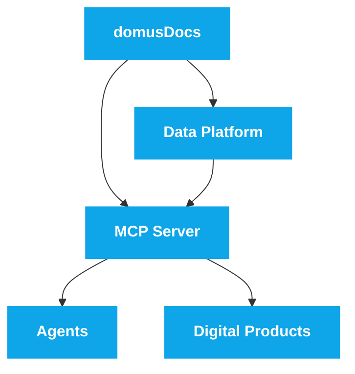

# Executive Overview: MCP-centered AI Transformation — 2025-09-09

- **domusDocs** provides modular LLM-based ingestion with governed retrieval and a blueprint registry.
- **MCP** is the control plane exposing governed tools and enforcing policy, audit, and observability.
- **Data Platform** consumes normalized outputs and powers analytics and models.
- **Agents** use MCP tools to retrieve, reason, and act (visualizations, tickets, workflows).

## Executive Diagram (Core Only)

