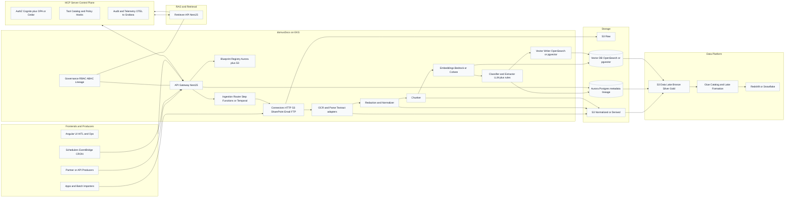

# domusDocs Architecture (AWS + K8s + MCP Integration) — 2025-09-09

This document describes the production-grade architecture of **domusDocs** as an enterprise document-intelligence backbone. It covers components, data flow, governance, integration with the MCP server, and the data platform feed.

## 1. Goals
- Modular **LLM-based** ingestion, processing, and storage powered by **Blueprints**.
- Governed access (RBAC/ABAC), lineage, HITL approvals.
- Tight integration with **MCP** (tool catalog, policy, audit) and **Data Platform** (Data Lake/Lakehouse).
- Multi-source ingestion (APIs, frontends/apps, schedulers, external systems).

## 2. High-Level Diagram

## 3. Responsibilities by Domain
- **API and Control Plane (NestJS on EKS):** ingress, MCP tool endpoints, policy enforcement, auditing.
- **Blueprint Registry:** versioned YAML or JSON; schema-validated; canary flags.
- **Ingestion Orchestration:** Step Functions or Temporal; idempotent workers; retries.
- **Processing:** Textract OCR, redaction, chunking, embeddings, classification/extraction.
- **Storage:** S3 (raw/normalized/derived), Aurora (metadata/extractions/lineage), Vector DB (OpenSearch or pgvector).
- **Governance:** RBAC, ABAC, redaction, lineage, HITL.
- **RAG Service:** hybrid retrieval BM25 then vector KNN then rerank; strict ABAC filters.
- **Data Platform Feed:** Bronze/Silver/Gold zones; Glue Catalog; Lake Formation policies.

## 4. Contracts
- **S3 layout:** raw, normalized, derived, manifest per document.
- **Aurora tables:** documents, extractions, lineage, decisions.
- **OpenSearch mapping:** embedding knn_vector and ABAC metadata fields.
- **MCP Tool Endpoints:** docs.search, docs.retrieve, docs.metadata; governed by OPA or Cedar.

## 5. Security, Reliability, Cost
- **Identity:** Cognito, IRSA; KMS encryption; private networking via VPC endpoints.
- **Observability:** OpenTelemetry traces; structured logs; SLOs.
- **Backpressure:** queues, admission controller; budget caps per blueprint.
- **Cost controls:** Intelligent-Tiering on S3; serverless Aurora; rightsize OpenSearch; batch embeddings.
