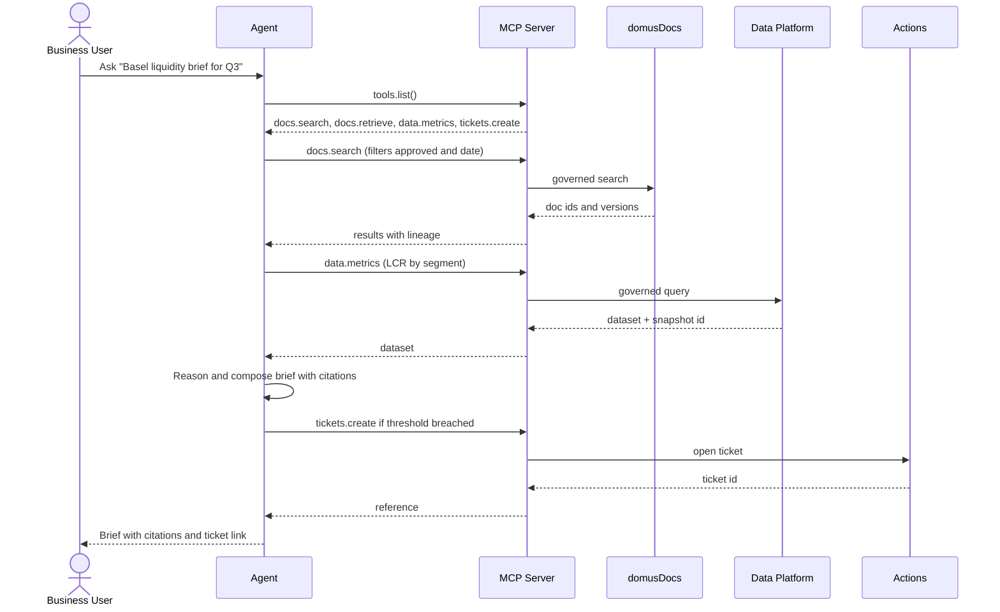

# MCP-Centered Agentic Layer and Data Access — 2025-09-09

This document details the **agentic AI layer** and how agents access enterprise data via the **MCP server** with strict governance.

## 1. Roles
- **Agents:** plan, select tools, call MCP to retrieve docs, metrics, and trigger actions.
- **MCP Server:** broker and policy enforcement point exposing tools with RBAC or ABAC, redaction, rate limits, and auditing.
- **domusDocs:** document truth with ACLs, embeddings, lineage, and HITL.
- **Data Platform:** governed metric APIs, lakehouse, feature store, and core models.

## 2. Sequence (typical task)

## 3. Tools Exposed by MCP
- **domusDocs tools:** `docs.search`, `docs.retrieve`, `docs.citations`, `docs.metadata`.
- **Data tools:** `data.sql`, `data.metrics`, `models.infer`.
- **Action tools:** `tickets.create`, `notify.send`, `workflows.start`.

## 4. Governance and Observability
- **AuthN/Z:** Cognito → capability token bound to scopes and purpose.
- **Policies:** OPA or Cedar pre-hooks; ABAC row/column filters.
- **Redaction:** PII scrubbed prior to agent response.
- **Decision Records:** trace inputs, tool calls, outputs, model IDs, blueprint version.
