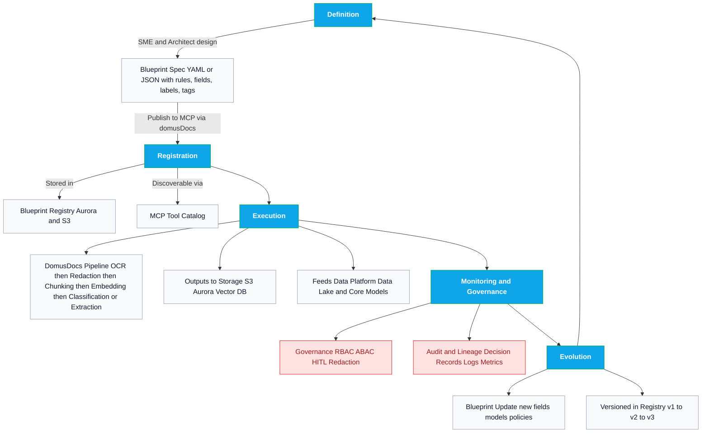

# Blueprint Concept, Ecosystem, and Lifecycle — 2025-09-09

## 1. What is a Blueprint?
A **Blueprint** is a **versioned declarative artifact** (YAML or JSON) that specifies how to ingest, process, extract, classify, and store documents for a **specific business use case**. It encodes business rules, compliance gates, and downstream actions.

## 2. Why Blueprints?
- Document and domain variability (contracts vs policies vs HR handbooks).
- Governance and traceability with consistent, repeatable runs.
- Scale via configuration rather than ad hoc code.

## 3. Ecosystem Placement
- **domusDocs:** authoritative registry and runtime executor of document blueprints.
- **MCP:** registers approved blueprints and exposes capabilities to agents/products.
- **Data Platform:** receives curated outputs (extractions, metrics, lineage).

## 4. Lifecycle
1. **Design** → author spec in repo; PR review.
2. **Validate** → JSON Schema + static policy checks.
3. **Publish** → store in S3; index in Aurora; status draft or approved.
4. **Register** → MCP indexes approved versions for discovery.
5. **Execute** → Step Functions or Temporal pipelines run with lineage.
6. **Monitor** → OTEL traces, OpenLineage facets, Decision Records.
7. **Evolve** → new versions, canary flags, replay strategy.

## 5. Lifecycle Diagram

## 6. Artifact Ownership and Placement
- **Authored and stored** in domusDocs (S3 canonical, Aurora index). 
- **Registered and exposed** by MCP for discovery and governed execution. 
- **Executed** by domusDocs pipelines; MCP brokers access and collects audit.

## 7. Standards to Anchor On
- **JSON Schema** to validate the artifact.
- **ASL** (Amazon States Language) or **Temporal** to execute workflows.
- **OpenAPI/AsyncAPI** for tool contracts and events.
- **OPA or Cedar** for policies.
- **OTEL and OpenLineage** for traces and lineage.
