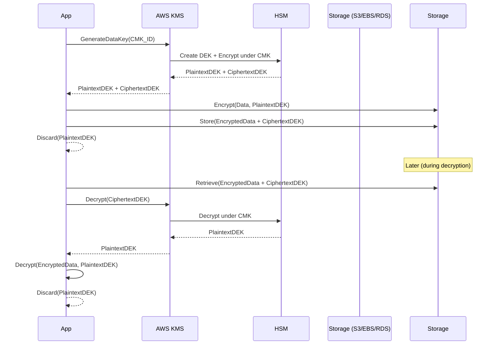

Excellent — let’s go deep into **how AWS encryption and decryption work**, focusing on **data encryption keys (DEKs)**, **master keys (CMKs/KMS keys)**, and their **lifecycle and sequence of operations**.

We’ll cover:

1. 🔑 Key concepts and hierarchy
2. 🔄 Encryption process sequence
3. 🔁 Decryption process sequence
4. ♻️ Key lifecycle (generation, rotation, retirement)
5. 🧠 Example: Envelope encryption flow
6. 🔒 How this ties into AWS KMS, S3, EBS, RDS, etc.

---

## 1️⃣ Key Concepts and Hierarchy

AWS uses **Envelope Encryption**, meaning:

* You **don’t encrypt data directly with the master key** (too slow and unsafe for large data).
* Instead, you use:

  * A **Data Encryption Key (DEK)** for encrypting your data (symmetric key).
  * A **Master Key** (AWS KMS key, also known as CMK – Customer Master Key) to encrypt and decrypt the DEK.

Hierarchical structure:

```
Customer Master Key (CMK / KMS Key)
        ↓ (encrypts)
Data Encryption Key (DEK)
        ↓ (encrypts)
Actual Data (files, DB rows, objects)
```

---

## 2️⃣ Encryption Process (Step-by-Step)

### 🔹 Step 1: Generate Data Encryption Key

When an AWS service (like S3 or EBS) or your app requests encryption, it asks KMS:

```
GenerateDataKey(CMK_ID)
```

AWS KMS responds with **two versions of the same DEK**:

* **Plaintext DEK** → used temporarily to encrypt data
* **Ciphertext DEK** → same DEK, but encrypted (wrapped) under the CMK

KMS never stores your plaintext DEK — it’s only returned to you for immediate use.

---

### 🔹 Step 2: Encrypt the Data

Your application or AWS service does:

```
EncryptedData = Encrypt(PlaintextData, PlaintextDEK)
```

You then **discard the plaintext DEK** (immediately from memory).
You store:

* Encrypted data (`EncryptedData`)
* Encrypted DEK (`CiphertextDEK`)

This pair is usually saved together (e.g., in S3 object metadata, EBS volume metadata, etc.).

---

### 🔹 Step 3: Store the Encrypted Artifacts

The **Ciphertext DEK** and **Encrypted Data** are persisted.
KMS doesn’t need to store the DEK — the ciphertext version contains all info needed for KMS to decrypt it later.

---

## 3️⃣ Decryption Process (Step-by-Step)

### 🔹 Step 1: Retrieve Encrypted Data and Ciphertext DEK

When you need to decrypt, fetch both from storage:

```
EncryptedData, CiphertextDEK
```

### 🔹 Step 2: Decrypt DEK using CMK

Call KMS:

```
PlaintextDEK = Decrypt(CiphertextDEK)
```

KMS verifies:

* Caller’s permissions (IAM/KMS key policy)
* Key is still active and not disabled/rotated
* Context conditions (encryption context, if used)

If approved, it returns the **Plaintext DEK**.

---

### 🔹 Step 3: Decrypt the Data

Your app or AWS service uses the plaintext DEK to decrypt:

```
PlaintextData = Decrypt(EncryptedData, PlaintextDEK)
```

Then it discards the plaintext DEK immediately from memory.

---

## 4️⃣ Key Lifecycle

### 🔸 Customer Master Key (CMK / KMS Key)

* **Created**: manually (customer-managed) or automatically (AWS-managed)
* **Stored**: securely in AWS KMS (FIPS 140-2 Level 3 validated HSMs)
* **Used for**: only encrypting/decrypting DEKs (not actual data)
* **Rotated**:

  * **Automatic rotation**: every year (for customer-managed keys)
  * **Manual rotation**: create a new CMK and re-encrypt DEKs
* **Retired/Deleted**: can be disabled or scheduled for deletion (after 7–30 days)

### 🔸 Data Encryption Key (DEK)

* **Ephemeral**: created per encryption request
* **Not stored** by KMS
* **Short-lived**: typically exists only in memory for milliseconds or seconds
* **Managed** by the service or application layer
* **Encrypted DEK** (ciphertext) is what’s persisted alongside data

---

## 5️⃣ Envelope Encryption Diagram



---

## 6️⃣ Real AWS Examples

| AWS Service         | Encryption Type             | How It Uses KMS                                     |
| ------------------- | --------------------------- | --------------------------------------------------- |
| **S3**              | SSE-S3, SSE-KMS, CSE-KMS    | S3 manages DEKs; KMS encrypts DEKs                  |
| **EBS**             | AES-256 per volume          | EBS manages DEKs; KMS encrypts DEKs                 |
| **RDS**             | Transparent Data Encryption | RDS manages DEKs via KMS                            |
| **Secrets Manager** | AES-GCM per secret          | Secrets stored encrypted; KMS key used for envelope |
| **Lambda env vars** | KMS encryption              | KMS decrypts at runtime                             |
| **CloudTrail logs** | KMS optional                | Protects log integrity and access                   |

---

## 7️⃣ Encryption Context (Optional but Important)

An **encryption context** is a set of key-value pairs you can attach when encrypting/decrypting via KMS:

```json
{
  "Service": "S3",
  "Bucket": "finance-docs"
}
```

KMS stores this context with the ciphertext and requires it for decryption — adding **additional integrity binding** between data and its usage domain.

---

## 8️⃣ Summary

| Concept                 | Description                                 |
| ----------------------- | ------------------------------------------- |
| **CMK / KMS Key**       | Root key managed by KMS; encrypts DEKs only |
| **DEK**                 | Symmetric key used to encrypt actual data   |
| **Envelope Encryption** | Protects data keys under master keys        |
| **Automatic rotation**  | Available for CMKs (annual)                 |
| **HSM-backed**          | All master keys protected by AWS HSM fleet  |
| **Least privilege**     | IAM + KMS key policy govern access          |
| **Auditability**        | CloudTrail logs every KMS operation         |

---

Would you like me to **add a full example with AWS SDK (Node.js or Python)** showing how the encryption/decryption process works end-to-end with `GenerateDataKey` and `Decrypt` API calls? It helps make the lifecycle even clearer.
