# Essence of Linear Algebra — Expanded Study Pack

**What this is.** A detailed companion to 3Blue1Brown’s *Essence of Linear Algebra* with step‑by‑step explanations and worked examples for every core idea, plus an all‑terms glossary. Formulas are embedded as PNGs for perfect Markdown rendering.

---

## 1. Vectors & Coordinates
**Idea.** A vector is something you can add and scale. Think "arrow from the origin" or "ordered n‑tuple". Coordinates tell you how much to scale each basis vector and add tip‑to‑tail.

**Key formulas.**
- Linear combination: 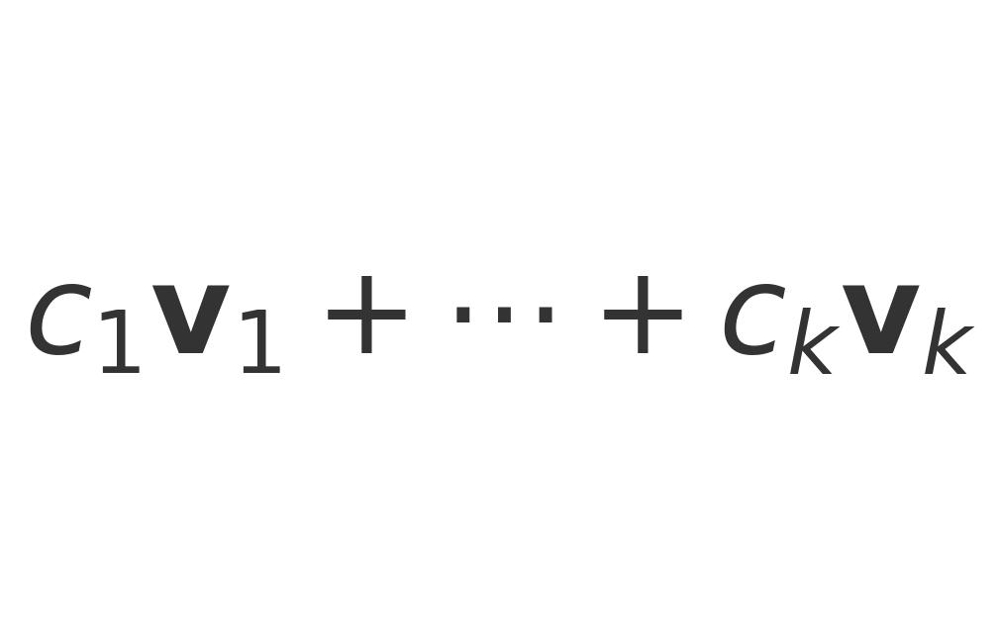

**Worked example.** Given v=(1,2) and w=(−2,1), express b=(−3,0) as c1 v + c2 w.  
Solve [v w][c1 c2]^T=b ⇒ [[1,−2],[2,1]][c1,c2]^T=[−3,0]^T. From the first row, c1−2c2=−3; from the second, 2c1+c2=0. Solving gives c2=1, c1=−1. So b=−1·v+1·w.

**Practice.** Change the target vector and repeat. Vary v,w until the system is singular to see dependence.

---

## 2. Span, Independence, Basis, Dimension
**Idea.** Span is the set of all linear combinations. A list is **independent** if only the trivial combination gives 0. A **basis** is an independent spanning set; its length is the **dimension**.

**Worked example (R^3).** v1=(1,1,0), v2=(0,1,1), v3=(1,0,1). Show they form a basis.  
Compute det([v1 v2 v3]) = det([[1,0,1],[1,1,0],[0,1,1]]) = 1·(1·1−0·1) − 0·(1·1−0·0) + 1·(1·1−1·0)=1+1=2≠0 ⇒ independent and spanning.

**Tip.** Pivots in row‑reduction identify a basis for the column space.

---

## 3. Linear Transformations & Matrices
**Idea.** A matrix is a linear map: it preserves add/scale and sends basis vectors to its columns. Matrix multiplication is **composition**: first do B, then A.

**Key relation.** 

**Worked example.** Let B=[[1,1],[0,1]] (shear x→x+y) and A=[[0,−1],[1,0]] (90° rotation). Compute AB and BA and apply to e1=(1,0), e2=(0,1) to see the order matters.

---

## 4. Determinant: Scale & Orientation
**Idea.** |det(A)| is area/volume scale; sign encodes orientation flip.

**Key snippets.**
- 2×2 determinant: 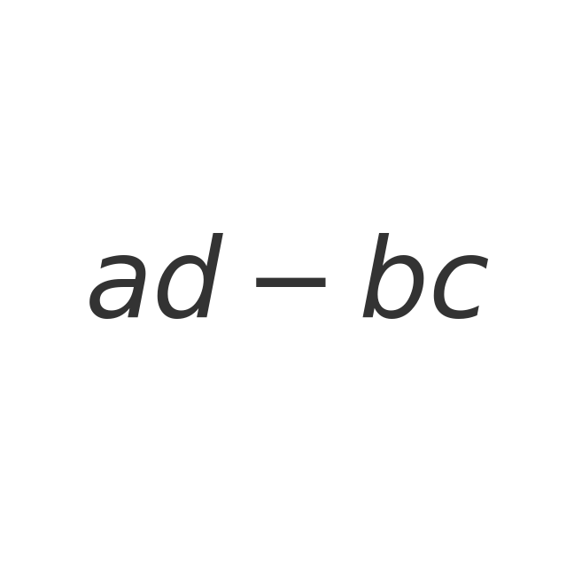
- Multiplicativity: 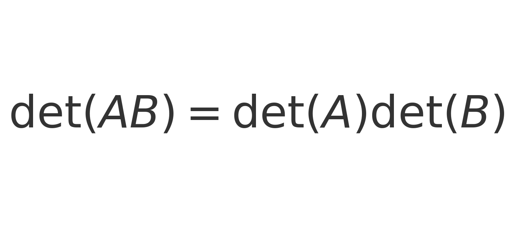

**Worked example.** A=[[3,1],[0,2]] ⇒ det=3·2−0·1=6. Unit square becomes area‑6 parallelogram. Reflection matrices have negative determinant (flip orientation).

---

## 5. Inverse, Column/Null Spaces, Rank
**Idea.** A is invertible iff det(A)≠0 ⇔ columns are independent ⇔ Null(A)={0}. Col(A) are reachable outputs; Null(A) are inputs killed by A.

**Key facts.**
- Inverse identity: 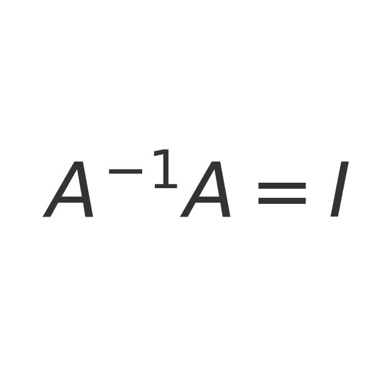
- Rank–Nullity: 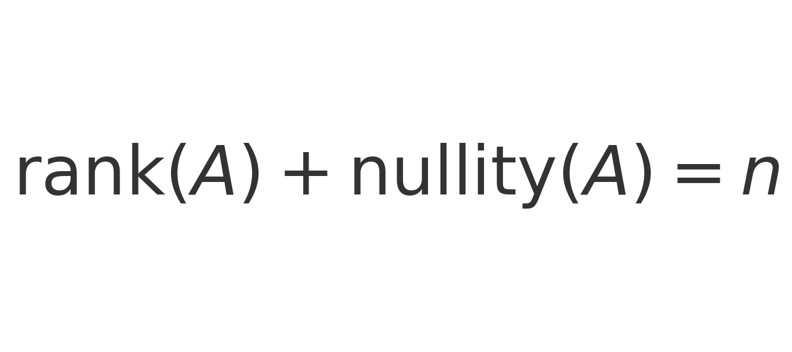

**Worked example.** For A=[[1,2,1],[0,1,1],[1,1,2]], row‑reduce to find pivots (rank) and a parametric description of Null(A). Check whether b=(2,3,3) lies in Col(A) by solving Ax=b.

---

## 6. Orthogonality, Dot Product, Projections, Gram–Schmidt, QR
**Idea.** The dot product measures alignment and defines length and angle.

**Key formulas.**
- Dot & angle: 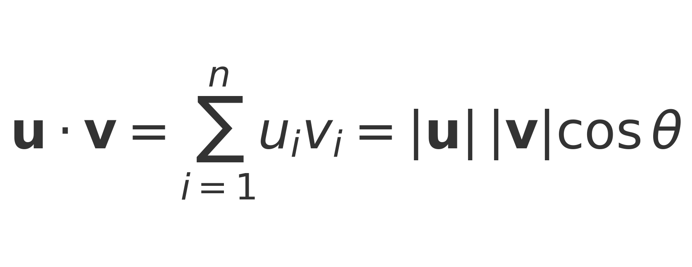 and 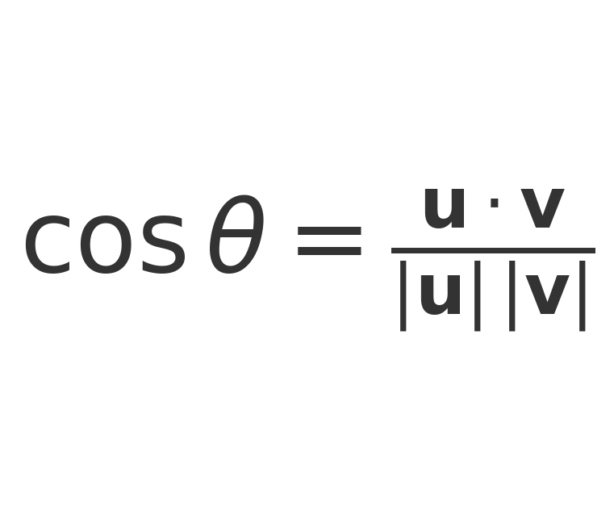
- Projection (onto a): 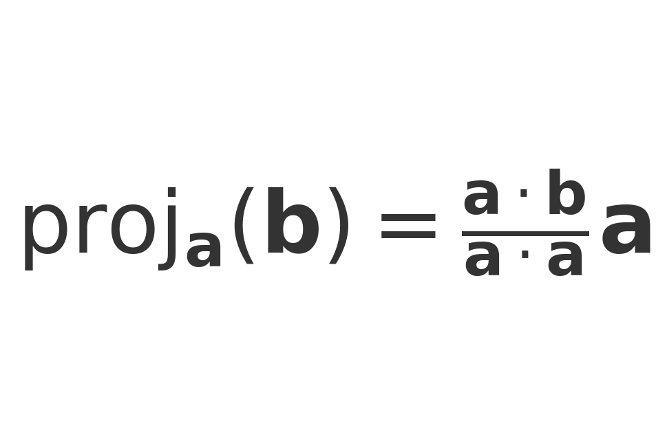

**Gram–Schmidt & QR.**
- Start with u1=v1, then normalize: 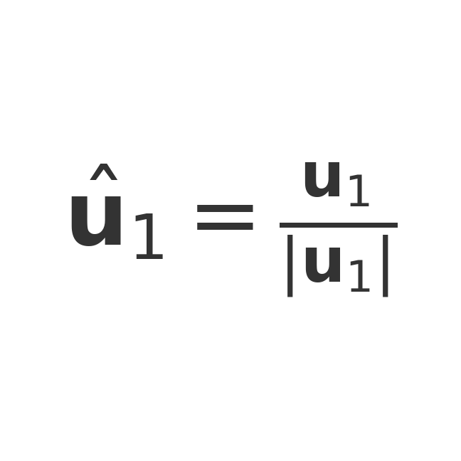  
- Make u2 orthogonal: 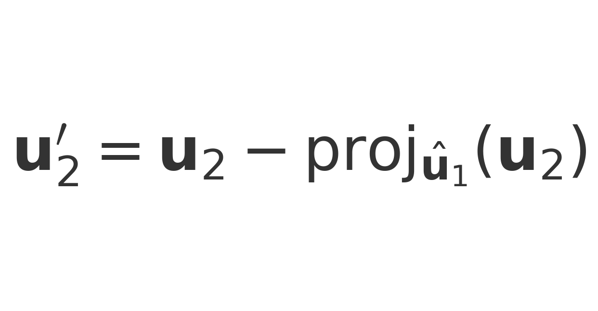  
- Collect orthonormal columns in Q and upper‑triangular in R: 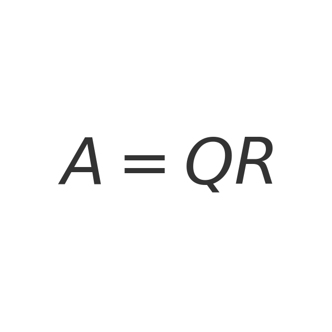
- Orthogonal matrices: 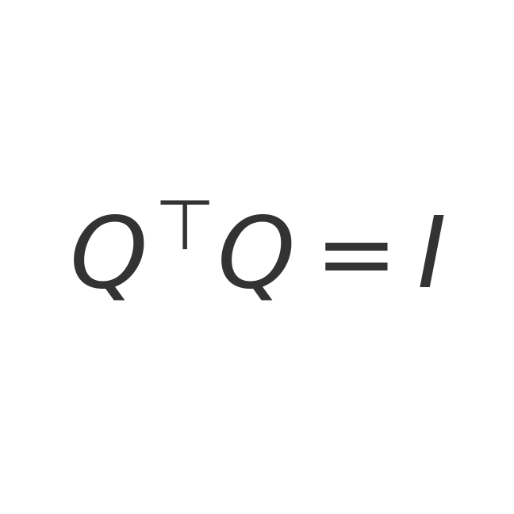

**Worked example.** Orthonormalize v1=(1,1,0), v2=(1,0,1). Compute u1-hat, then u2' = v2 − proj_{u1-hat}(v2). Normalize u2' to get u2-hat. Set Q=[u1-hat u2-hat], find R=Q^T A for A=[v1 v2].

---

## 7. Cross Product & Oriented Areas/Volumes
**Idea.** In 2D, the signed area spanned by (x1,y1) and (x2,y2) is x1y2−x2y1. In 3D, u×v is perpendicular to the plane with magnitude equal to the parallelogram area.

**Key relations.**
- Magnitude: 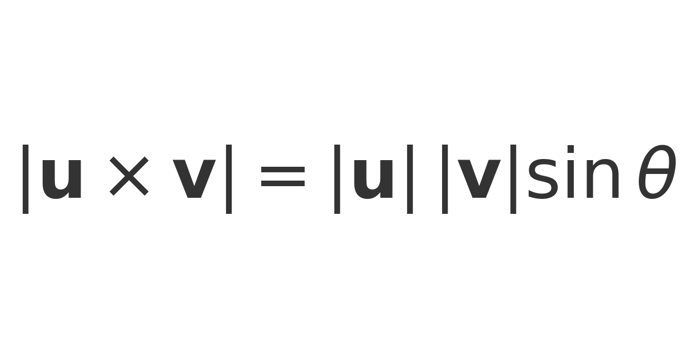
- Coordinates: 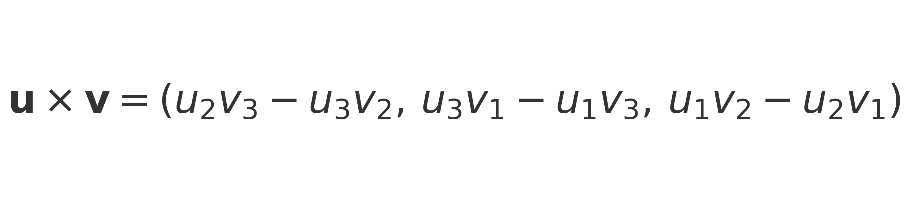

**Worked example.** u=(2,−1,0), v=(1,3,4) ⇒ u×v=(−4,−8,7). Area = ||u×v|| = √(16+64+49)=√129.

---

## 8. Least Squares & Projections (Pseudoinverse)
**Idea.** When Ax≈b has no exact solution, choose x̂ minimizing ||Ax−b||. Geometrically: project b onto Col(A).

**Key formulas.**
- Normal equations: 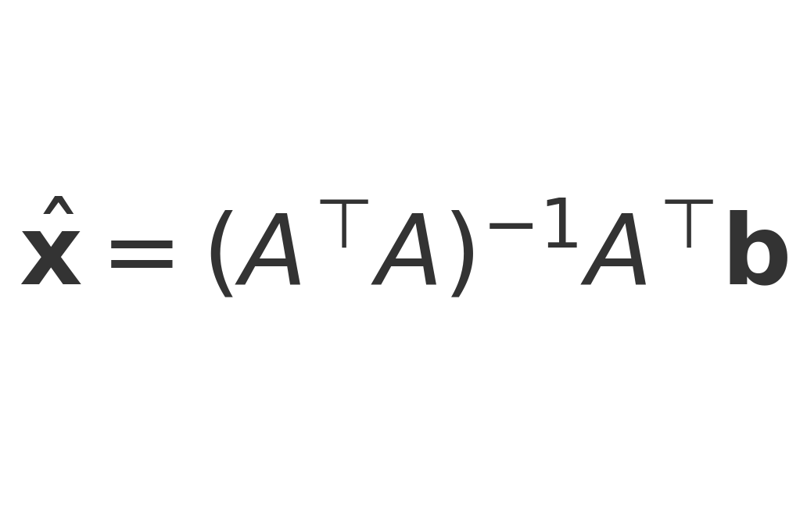
- Orthogonal projector onto Col(A): 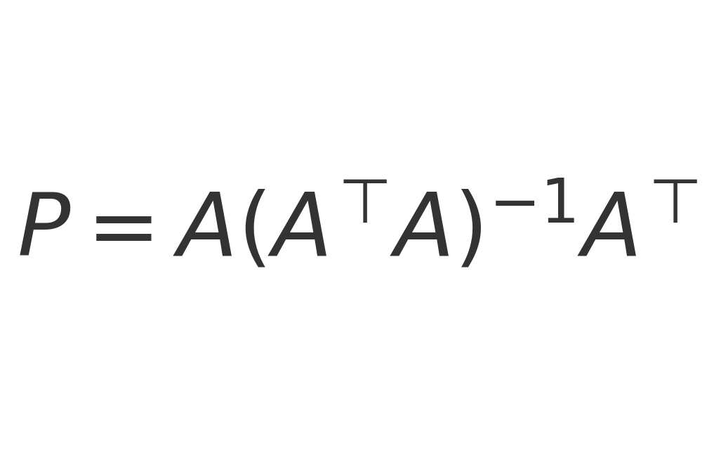
- Pseudoinverse (via SVD): 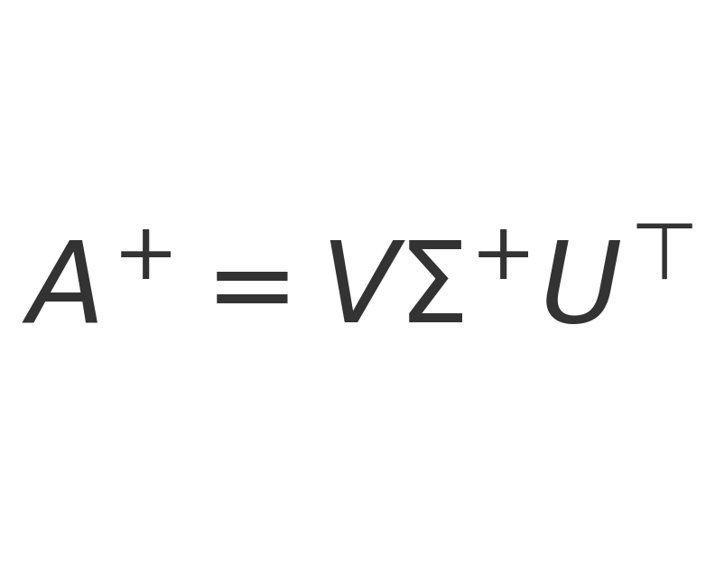

**Worked example.** Fit y≈mx+c to points (0,1),(1,2),(2,2). Build A=[[0,1],[1,1],[2,1]], b=[1,2,2]^T. Compute A^T A and A^T b; solve (A^T A)x=A^T b to get m≈0.5, c≈1.17.

---

## 9. Change of Basis & Similarity
**Idea.** Coordinates depend on the chosen basis. With P built from new basis vectors, coordinates and linear maps transform as:  
- Vector coords: 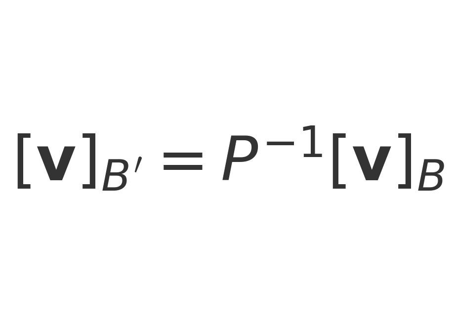  
- Similarity: 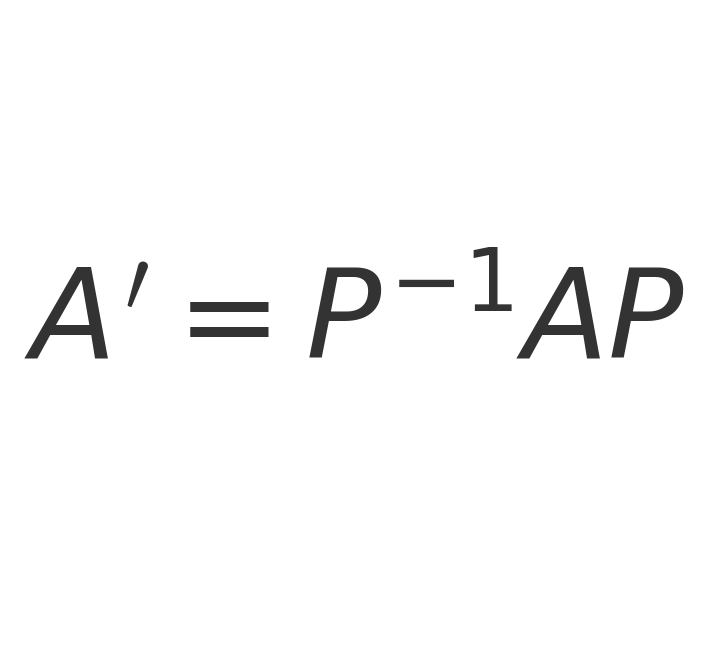

**Worked example.** Use basis B' = {(1,1),(1,−1)}. Convert v=(3,1) to [v]_{B'}; then conjugate A=[[2,1],[0,1]] to A' in B'.

---

## 10. Eigenvalues & Eigenvectors
**Idea.** Directions v that keep their line under A but get scaled by λ: 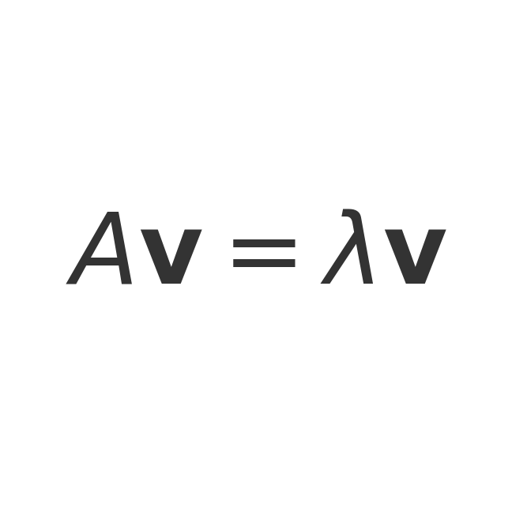. Solve the characteristic equation: 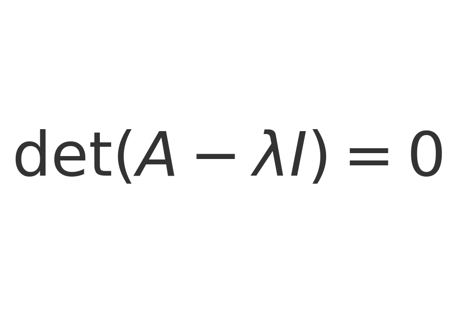. Repeated application amplifies directions with |λ| largest.

**Worked example (2×2).** A=[[4,1],[2,3]]. det(A−λI)=(4−λ)(3−λ)−2=λ^2−7λ+10 ⇒ λ∈{5,2}.  
For λ=5, (A−5I)v=0 ⇒ [[−1,1],[2,−2]]v=0 ⇒ v along (1,1). For λ=2, eigenvectors along (−1,2).

**Symmetric case.** If A is symmetric, it has an orthonormal eigenbasis and real eigenvalues (spectral theorem).

---

## 11. Singular Value Decomposition (SVD)
**Idea.** Any m×n matrix factors as rotations/reflections (U,V) and axis‑wise scalings (Σ): 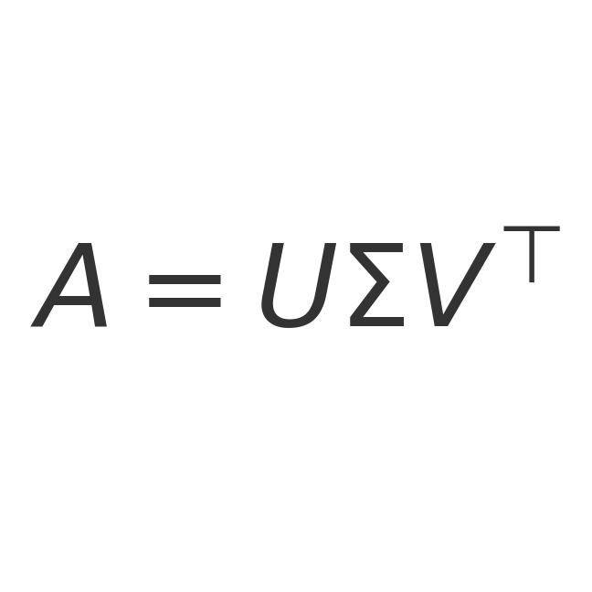. Singular values measure how much A stretches along orthogonal directions; rank is number of nonzero singular values.

**Worked example (2×2).** For A=[[3,0],[4,0]], compute A^T A=[[25,0],[0,0]]. Eigenvalues 25 and 0 ⇒ singular values 5 and 0. V has eigenvectors e1,e2; U=AVΣ^{+}.

**Uses.** Low‑rank approximation, conditioning, pseudoinverse, PCA.

---

## 12. Abstract Vector Spaces & Linear Functionals
**Idea.** Vectors can be polynomials (e.g., degree ≤2), functions, or sequences. A linear functional maps vectors to scalars (e.g., inner product with a fixed vector). Many results carry over unchanged.

---

## 13. Practice Set (Selected)
1) Decompose b=(2,3,5) into a component along a=(1,1,1) and a perpendicular component.  
2) Find a QR decomposition of A=[[1,1],[1,0],[0,1]].  
3) Compute the least‑squares line for points (−1,0),(0,1),(2,1).  
4) Diagonalize (if possible) A=[[2,0,0],[0,3,1],[0,0,3]].  
5) Use SVD intuition to explain why rank(A)=rank(A^T A).

---

# Glossary (Comprehensive)
Abstract vector space — Any set with vector addition and scalar multiplication that satisfies the vector axioms.  
Angle between vectors — Defined via the dot product: .  
Basis — Independent list that spans a space; its length is the dimension.  
Change of basis — Rewriting coordinates relative to a new basis; see .  
Characteristic polynomial — det(A−λI), whose roots are eigenvalues.  
Column space (Col(A)) — Span of the columns of A (reachable outputs).  
Determinant — Signed area/volume scale for a linear map; multiplicative: .  
Diagonalizable — Matrix similar to a diagonal matrix (has a complete eigenbasis).  
Dot product — Measures alignment and length; see .  
Eigenvalue/Eigenvector — λ and v with Av=λv; drive long‑term dynamics of repeated multiplication.  
Gram–Schmidt — Process to orthonormalize vectors; see , .  
Identity (I) — Leaves vectors unchanged.  
Inverse (A⁻¹) — Undoing transformation: .  
Least squares — Choose x̂ minimizing ||Ax−b||; normal equations: .  
Linear combination — .  
Linear transformation — Map preserving add/scale (straight grid lines, origin fixed).  
Matrix multiplication — Composition of linear maps; do B then A: .  
Null space (kernel) — Inputs sent to 0 by A.  
Orthogonal matrix — Columns are orthonormal; preserves lengths: .  
Orthogonal projector — P=A(A^T A)^{-1}A^T projects onto Col(A).  
Rank — Dimension of Col(A).  
Rank–nullity — .  
Similarity transform — A'=P^{-1}AP; same linear map viewed in a different basis.  
Singular Value Decomposition — A=UΣV^T; universal factorization; .  
Span — All linear combinations of a set of vectors.  
Unit vector — Vector of length 1; helpful for directions.  

---

**Study tips.** After each concept, sketch the grid/basis movement; check numeric examples against geometry. Re‑derive the PNG formulas from memory and verify with a small example.
