# Essence of Linear Algebra — Concise Study Guide

A brief but comprehensive set of notes to accompany 3Blue1Brown’s **Essence of Linear Algebra** playlist. Each section gives the geometric idea, a key formula (embedded as a PNG for GitHub‑friendly rendering), and quick practice prompts.

> Playlist: https://www.youtube.com/playlist?list=PLZHQObOWTQDPD3MizzM2xVFitgF8hE_ab

---

## 1) Vectors, Linear Combinations, Span, Basis
**Idea.** Vectors can be *added* and *scaled*. Linear combinations of a set form its **span**. If only the trivial combo gives zero, the set is **independent**. A **basis** is an independent spanning set; its size is the **dimension**.

- Vector addition: 
- Scaling: 

**Practice.** Express a target vector as a linear combo; test independence.

---

## 2) Linear Transformations and Matrices
**Idea.** A matrix **A** encodes a linear map: it sends basis vectors to its columns and all other vectors by the same linear rule. Matrix multiplication means *compose* linear maps.

- Matrix–vector: 
- Composition: 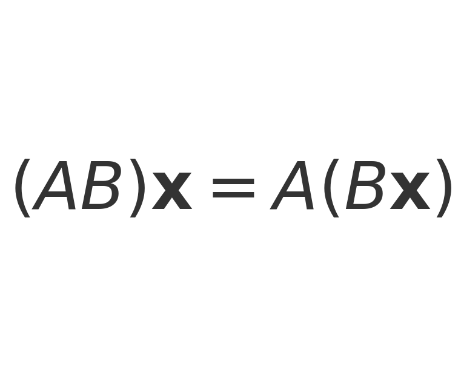

**Practice.** Sketch how **A** moves a grid; compare AB vs BA.

---

## 3) Determinant and Inverse
**Idea.** det(**A**) is the signed area/volume scaling. det=0 ⟹ space collapses (not invertible). **A**⁻¹ undoes **A** when it exists.

- Scaling factor: 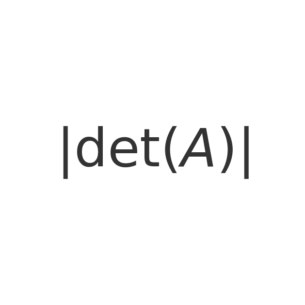
- Inverse identity: 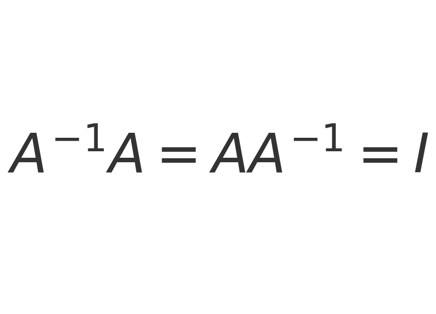

**Practice.** Estimate det from pictures; invert small matrices.

---

## 4) Column Space, Null Space, Rank–Nullity
**Idea.** **Col(A)** is the span of columns (all achievable outputs). **Null(A)** is inputs mapped to zero. Their dimensions add to the domain dimension.

- Rank–Nullity: 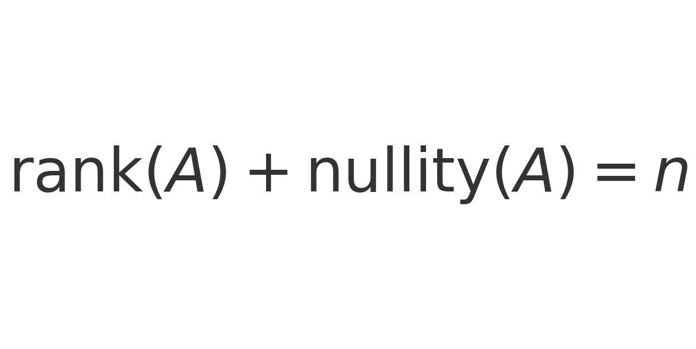

**Practice.** Solve **A**x=0; identify pivot columns and rank.

---

## 5) Dot Product, Projections, Orthogonality
**Idea.** Dot product measures alignment; projections split vectors into “along **a**” and “perpendicular to **a**”. Orthogonal matrices preserve lengths and angles (pure rotations/reflections).

- Definitions: 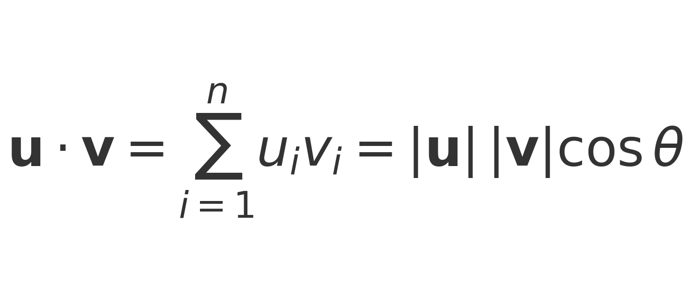
- Projection: 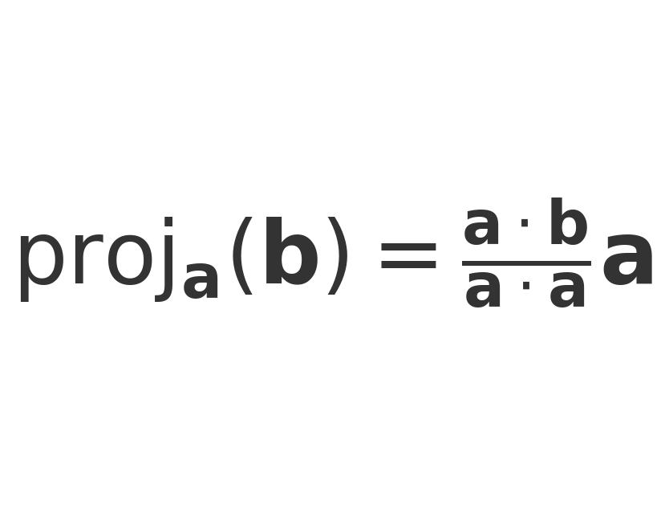
- Orthogonal matrices: 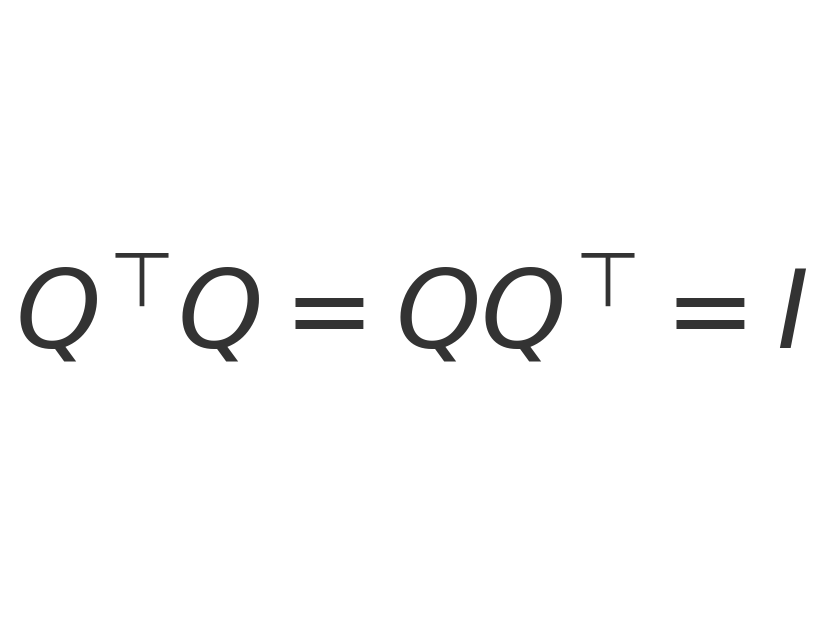

**Practice.** Compute proj\_a(b) and b−proj; identify orthogonal matrices.

---

## 6) Cross Product (3D) and Determinants
**Idea.** In 3D, **u**×**v** is perpendicular to the plane with magnitude equal to the parallelogram area; ties closely to determinants.

- Magnitude: 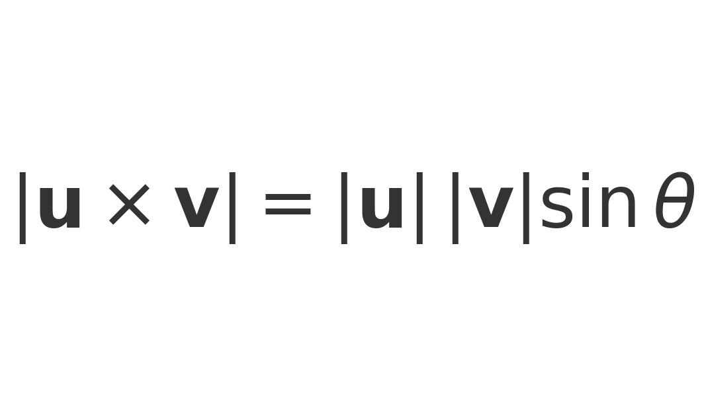

**Practice.** Use right‑hand rule; compute areas by |u×v|.

---

## 7) Nonsquare Matrices and Least Squares
**Idea.** Rectangular **A** maps between different dimensions. If **A**x=b has no exact solution, least squares projects **b** onto Col(**A**).

- Normal equations: 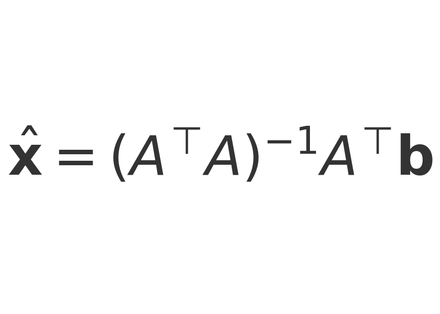
- Pseudoinverse: 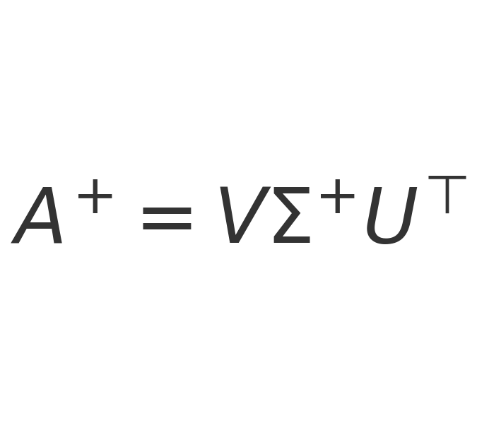

**Practice.** Solve overdetermined systems via normal equations or QR/SVD.

---

## 8) Change of Basis
**Idea.** Coordinates depend on basis. The change‑of‑basis matrix **P** converts coordinates and conjugates linear maps: A' = P⁻¹AP.

- Coordinates: 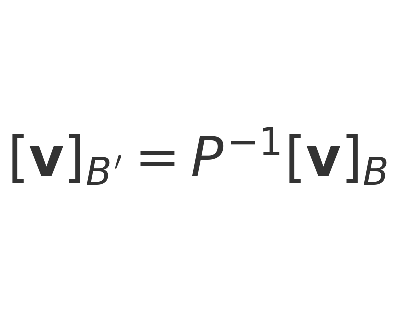

**Practice.** Build **P** for two bases; convert vectors and matrices.

---

## 9) Eigenvalues/Eigenvectors and SVD
**Idea.** Eigenvectors keep direction under **A** with scale λ. The **SVD** writes any **A** as rotations/reflections and axis‑wise scalings.

- Eigen relation: 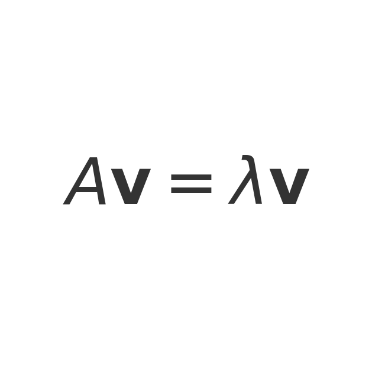
- Singular Value Decomposition: 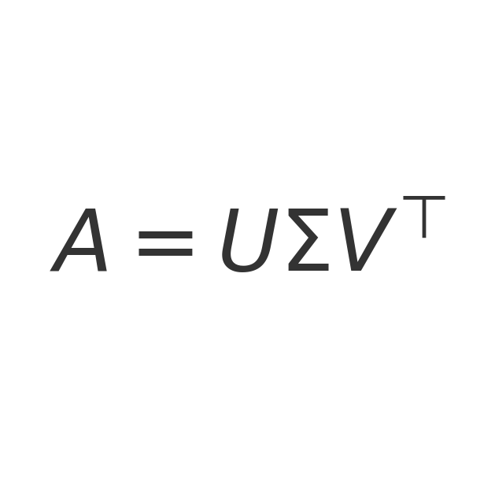

**Practice.** For 2×2: solve det(A−λI)=0. Use SVD to analyze rank and conditioning.

---

## Minimal Viewing Roadmap
1. Vectors → Linear combinations/span/basis → Linear transformations → Matrix multiplication  
2. 3D transformations (optional) → Determinant → Inverse/column/null  
3. Nonsquare matrices → Dot product → Cross product (optional)  
4. Change of basis → Eigenvalues/eigenvectors → SVD → Abstract vector spaces

**Tip:** After each video, re‑derive the key PNG formula(s) from scratch.

---

## Sources & Further Reading
- 3Blue1Brown — *Essence of Linear Algebra* playlist: https://www.youtube.com/playlist?list=PLZHQObOWTQDPD3MizzM2xVFitgF8hE_ab
- 3Blue1Brown — Linear Algebra topic page (article companions): https://www.3blue1brown.com/topics/linear-algebra

*All formulas are embedded as PNGs for reliable rendering across Markdown viewers.*
