# Essence of Linear Algebra — Complete Study Pack

**Source playlist:** https://www.youtube.com/playlist?list=PLZHQObOWTQDPD3MizzM2xVFitgF8hE_ab

This guide follows 3Blue1Brown’s *Essence of Linear Algebra* series and adds concise explanations, worked examples, and a comprehensive glossary of the terms used across the lessons. All formulas are embedded as PNG images for reliable Markdown rendering.

---

## Contents
1. Vectors and Coordinates  
2. Linear Combinations, Span, Basis, and Dimension  
3. Linear Transformations & Matrices (incl. Matrix Multiplication)  
4. 3D Transformations (intuition)  
5. Determinant (area/volume scale & orientation)  
6. Inverse, Column Space, Null Space, Rank  
7. Nonsquare Matrices (between dimensions)  
8. Dot Product, Projections, Orthogonality, Duality  
9. Cross Product (2D & 3D intuition)  
10. Cramer’s Rule (geometric viewpoint)  
11. Change of Basis & Similarity  
12. Eigenvalues/Eigenvectors & Eigenbasis  
13. Abstract Vector Spaces  
14. Glossary (comprehensive)  

---

## 1) Vectors and Coordinates
**Idea.** Vectors can be seen as arrows (physics view) or ordered lists (CS view); the mathematician abstracts both as any object with sensible addition and scalar multiplication. Coordinates describe how to get from the origin to the tip of the arrow.

- Addition:   
- Scalar multiplication: 

**Example.** [1,2] + [3,−1] = [4,1]. Scaling by −2 flips and doubles length: −2·[1,2] = [−2,−4].

**Checklist.** Convert between geometric arrows and coordinate lists; add/scale both ways.

---

## 2) Linear Combinations, Span, Basis, and Dimension
**Idea.** A linear combination of v1,…,vk is c1 v1+⋯+ck vk. The span is the set of all such combinations. A set is linearly independent if only c1=⋯=ck=0 gives 0. A basis is an independent spanning set; its size is the dimension.

**Example.** In R^2, span{(1,0),(0,1)}=R^2. But (1,0) and (2,0) are dependent (same line).

**Checklist.** Given vectors, decide if they span a space; test independence by solving c1 v1+⋯+ck vk=0.

---

## 3) Linear Transformations & Matrices
**Idea.** A transformation is linear if (1) lines remain lines and the origin is fixed, and (2) addition/scaling are preserved. A matrix encodes where basis vectors go; matrix multiplication means compose transformations.

- Composition law: 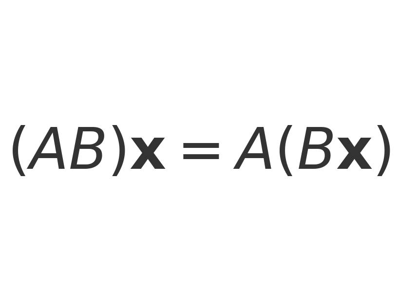

**Example.** If B shears by x→x+y and A rotates by 90°, AB means “do the shear, then rotate.”

**Checklist.** Read columns of A as where basis vectors land; view AB as do B then A.

---

## 4) Three‑Dimensional Transformations (intuition)
**Idea.** Everything from 2D generalizes: 3×3 matrices stretch/rotate/shear 3D space; composition still reads right‑to‑left.

**Example.** A scaling by 2 in x, 1 in y, 3 in z maps the unit cube to a 2×1×3 box (volume scales by 6).

---

## 5) Determinant (Area/Volume Scale & Orientation)
**Idea.** |det(A)| is the area/volume scaling of the unit square/cube under the linear map; det(A)<0 indicates orientation flip. For 2×2, 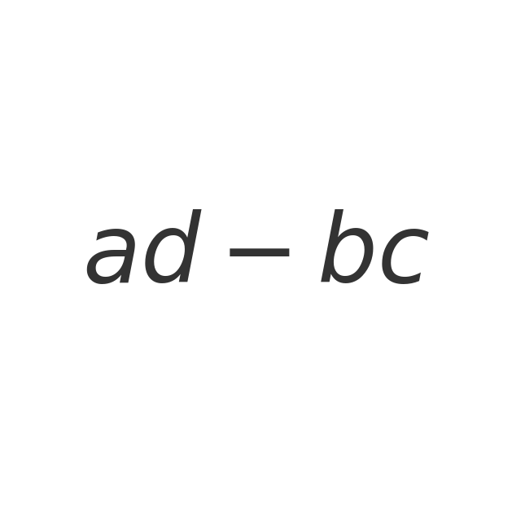. Properties: 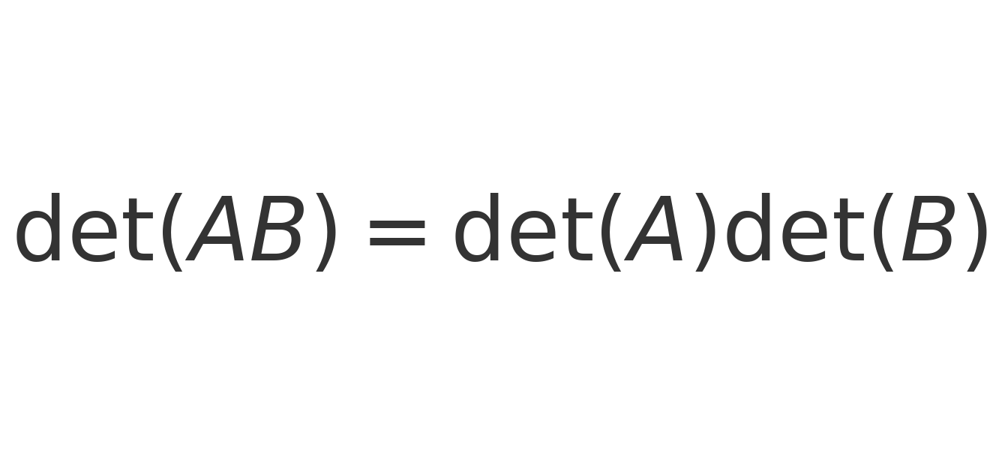.

**Example.** A=[[3,0],[0,2]] scales area by 6. A reflection has negative determinant.

**Checklist.** Estimate det from pictures; compute 2×2/3×3; use det(AB)=det(A)det(B).

---

## 6) Inverse, Column Space, Null Space, Rank
**Idea.** The inverse undoes a transformation: 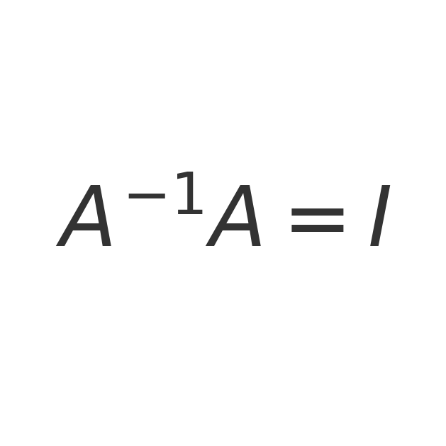. Column space Col(A) is span of columns (outputs you can reach). Null space Null(A) are inputs mapped to 0. Rank is dim Col(A); nullity is dim Null(A); 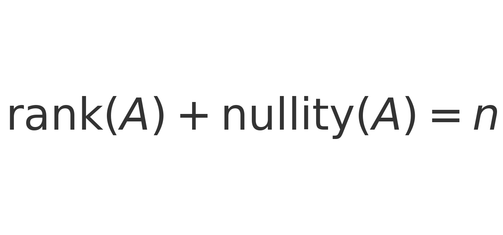.

**Example.** Solve Ax=b by checking if b∈Col(A). If not invertible, describe the solution set as one particular solution plus Null(A).

**Checklist.** Identify pivots, rank; describe Null(A) with parameters.

---

## 7) Nonsquare Matrices (between dimensions)
**Idea.** Linear maps can go R^n→R^m with m≠n. Think of stretching a grid between spaces; composition still works when inner dimensions match.

**Example.** A 2×3 matrix embeds 2D into 3D as a slanted plane; a 3×2 drops 3D to 2D (loses information).

---

## 8) Dot Product, Projections, Orthogonality, Duality
**Idea.** The dot product measures alignment: 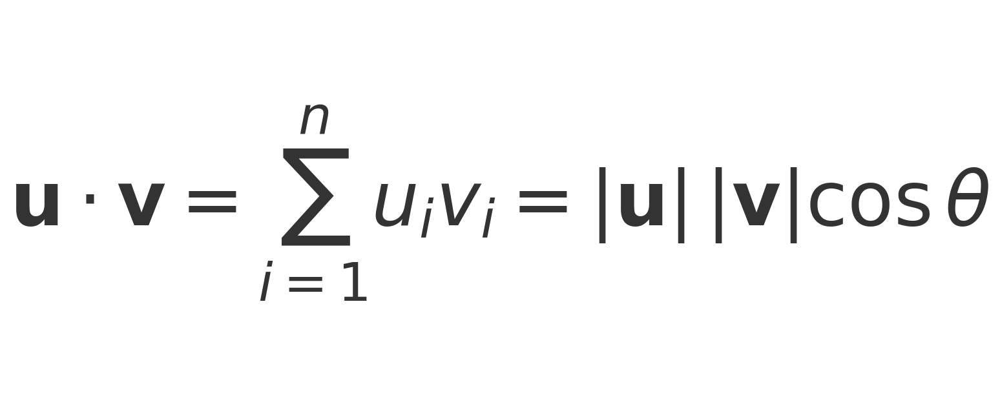. The projection of b onto a: 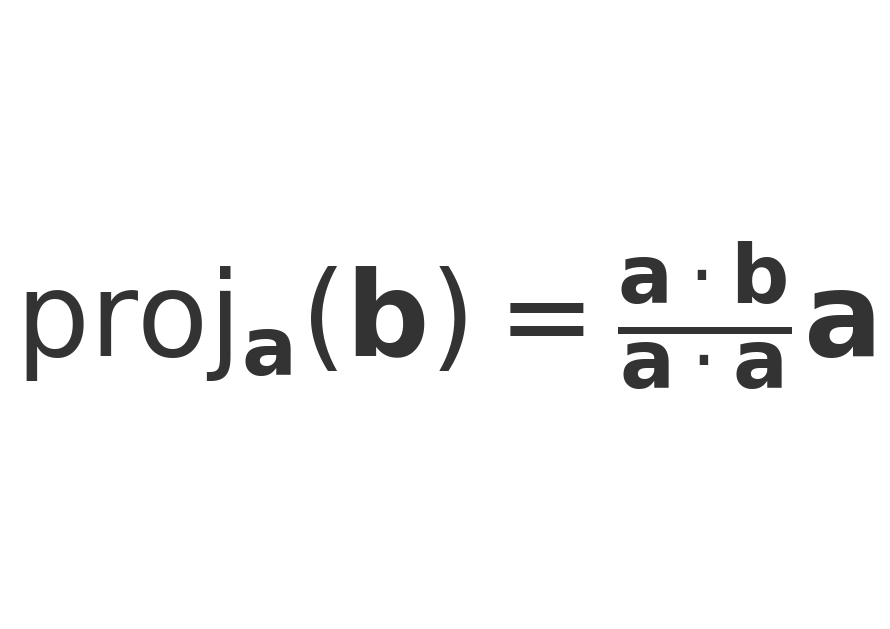. Orthogonal matrices preserve lengths/angles: 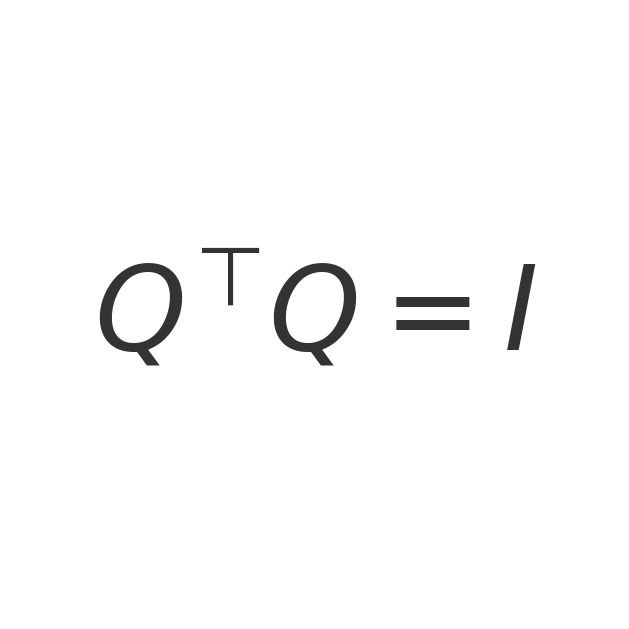.

**Example.** For a=(3,4), ||a||=5. Project b=(5,1) onto a: ((a·b)/(a·a)) a = (19/25)(3,4) = (57/25,76/25).

**Checklist.** Compute angles via dot; decompose a vector into along/perpendicular parts.

---

## 9) Cross Product (2D & 3D intuition)
**Idea.** In 2D, the signed area spanned by u,v is det([u v]). In 3D, u×v is perpendicular to both, with magnitude 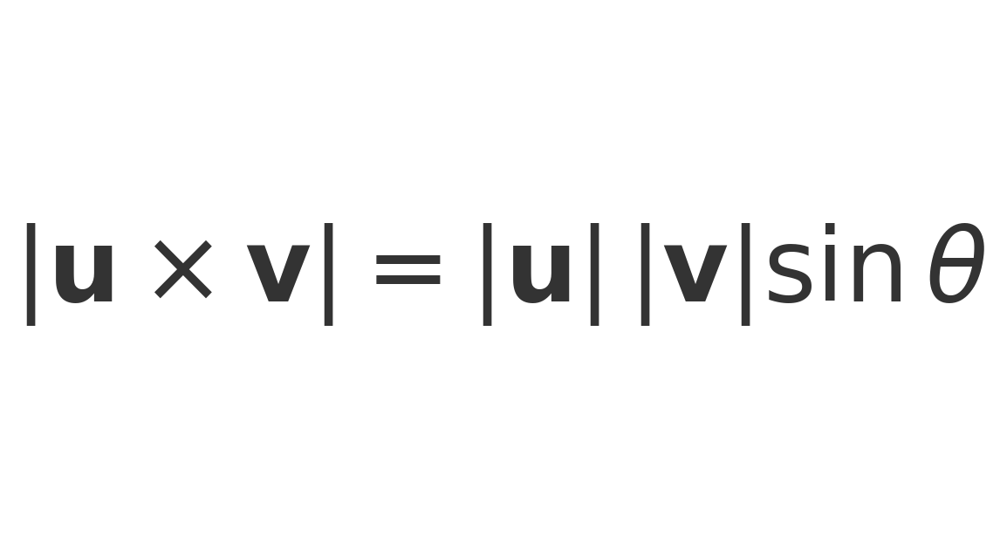 and components 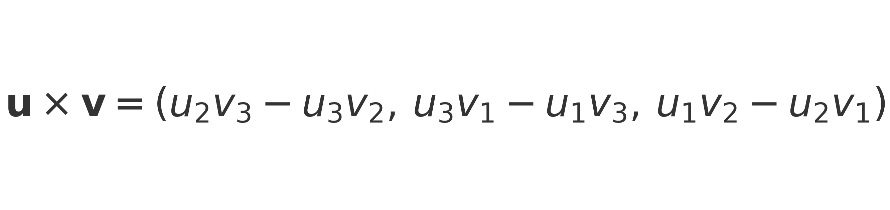. Right‑hand rule sets direction.

**Example.** u=(2,0,0), v=(0,−3,0) ⇒ u×v=(0,0,−6).

---

## 10) Cramer’s Rule (geometric viewpoint)
**Idea.** For 2×2, solutions replace a column by b and divide determinants; see: 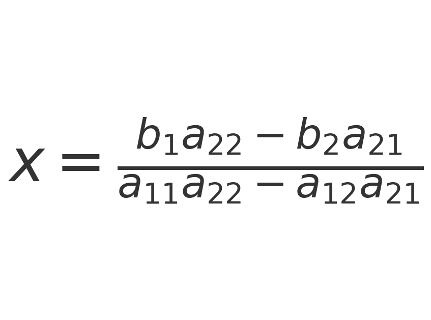 and 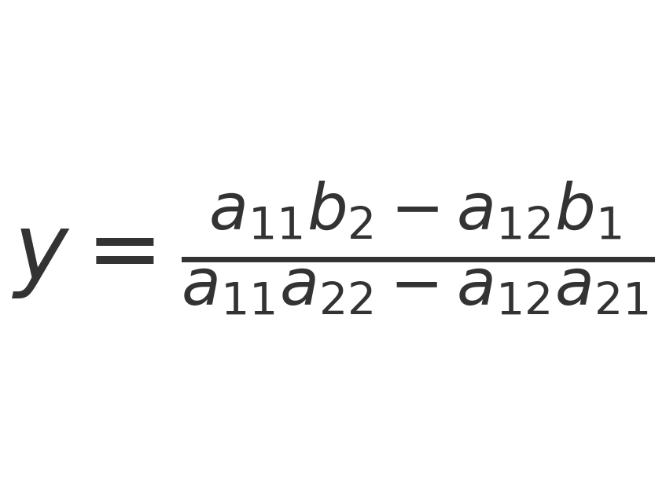. Works when det(A)≠0.

**Example.** Solve { 2x+y=4, x+3y=5 } ⇒ x=(4·3−5·1)/(2·3−1·1)=7/5, y=(2·5−1·4)/(2·3−1·1)=6/5.

---

## 11) Change of Basis & Similarity
**Idea.** Coordinates depend on basis. If P has new basis vectors as its columns, then vector coordinates and linear maps transform as:  
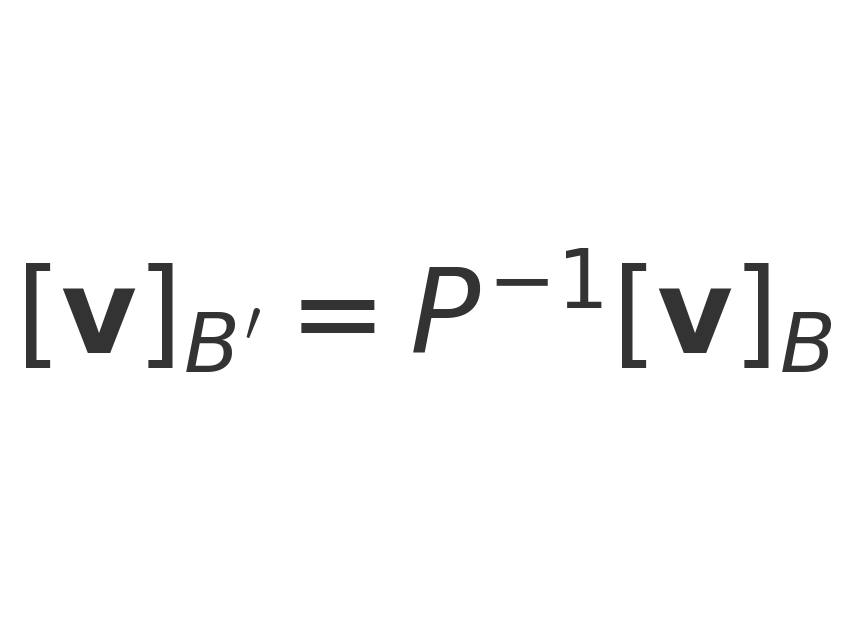 and 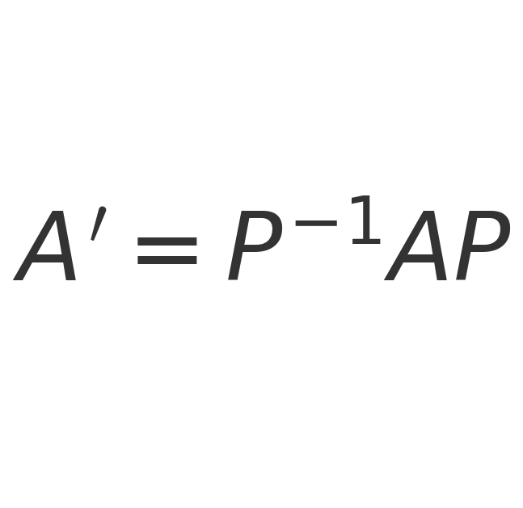.

**Example.** Use eigenvectors as a basis to diagonalize a matrix (when possible).

---

## 12) Eigenvalues/Eigenvectors & Eigenbasis
**Idea.** Special vectors stay on their own span: 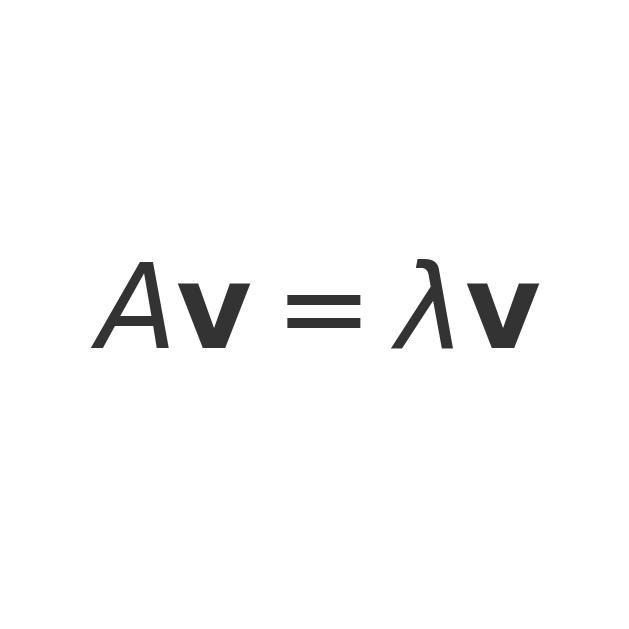. Solve 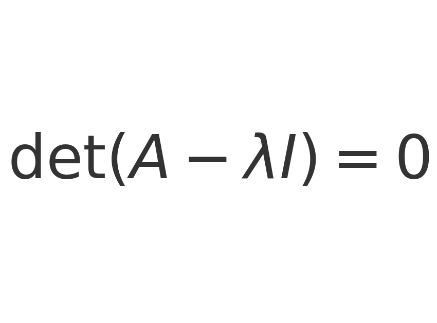. If a matrix has a full set of eigenvectors, change to that basis to diagonalize it.

**Example (2×2).** For A=[[3,1],[0,2]], the eigenvalues are roots of (3−λ)(2−λ)=0 ⇒ λ∈{3,2}. For λ=2, solving (A−2I)v=0 gives eigenvectors along (−1,1).

---

## 13) Abstract Vector Spaces
**Idea.** Beyond arrows/lists, a vector space is any set with addition and scalar multiplication obeying standard axioms (closure, associativity, etc.). Examples include polynomials, functions, and sequences.

---

# Glossary (Comprehensive)
* **Vector:** Arrow (length & direction) or ordered list; basic object of linear algebra.  
* **Scalar:** A number that scales vectors under multiplication.  
* **Component/Coordinate:** The entries of a vector relative to a basis.  
* **Standard basis:** The usual coordinate axes vectors (e.g., e1=(1,0,...)).  
* **Linear combination:** Expression c1 v1 + … + ck vk.  
* **Span:** Set of all linear combinations of a list of vectors.  
* **Linear independence:** Only the trivial combination yields 0.  
* **Basis:** Independent set that spans the space.  
* **Dimension:** Number of vectors in a basis.  
* **Linear transformation:** Map preserving addition and scalar multiplication (lines stay lines; origin fixed).  
* **Matrix:** Array encoding a linear transformation with respect to chosen bases; columns are images of basis vectors.  
* **Matrix–vector product:** Linear combination of the columns of the matrix weighted by vector components.  
* **Matrix multiplication:** Composition of linear maps; (AB)x = A(Bx).  
* **Identity matrix (I):** Leaves every vector unchanged.  
* **Inverse matrix (A⁻¹):** Satisfies A⁻¹A = I (undoes A).  
* **Determinant:** Signed scaling of area/volume under a linear map; negative means orientation flip.  
* **Orientation:** Handedness (right/left) of basis; flips when det<0.  
* **Parallelogram/Parallelepiped:** Images of the unit square/cube under linear maps; visualize det as their area/volume.  
* **Column space Col(A):** Span of columns (all achievable outputs).  
* **Row space:** Span of rows; orthogonal complement to Null(A) in R^n.  
* **Null space / Kernel:** All vectors sent to 0 by A.  
* **Rank:** dim Col(A).  
* **Nullity:** dim Null(A).  
* **Rank–nullity theorem:** rank(A)+nullity(A)=#columns.  
* **Nonsquare matrix:** Linear map between spaces of different dimensions.  
* **Dot product:** u·v = Σ u_i v_i = ||u|| ||v|| cosθ; measures alignment.  
* **Norm/Length ||v||:** Square root of v·v.  
* **Orthogonal vectors:** Dot product 0.  
* **Orthogonal/Orthonormal basis:** Mutually perpendicular (and unit) vectors; orthogonal matrices preserve lengths/angles.  
* **Projection:** Component of b along a given direction/subspace.  
* **Cross product (3D):** Vector perpendicular to u and v with length ||u|| ||v|| sinθ; direction by right‑hand rule.  
* **Right‑hand rule:** Thumb = u×v when fingers curl u→v.  
* **Cramer’s rule:** Determinant formula to solve small linear systems when det≠0.  
* **Change of basis:** Re-express vectors/transformations in a new coordinate system using a change-of-basis matrix P.  
* **Similarity transform:** A' = P⁻¹ A P; same linear map viewed in a different basis.  
* **Eigenvector/Eigenvalue:** Av=λv; directions scaled by A with factor λ.  
* **Characteristic polynomial:** det(A−λI); roots are eigenvalues.  
* **Diagonal matrix:** Zeros off-diagonal; indicates basis vectors are eigenvectors.  
* **Diagonalizable:** Has a full eigenbasis so it becomes diagonal in that basis.  
* **Shear/Rotation/Scaling:** Common geometric effects of 2D/3D linear maps.  
* **Abstract vector space:** General setting where “vectors” need not be arrows/lists but obey vector axioms.

---

## Sources (watch/read alongside)
- 3Blue1Brown — *Essence of Linear Algebra* (YouTube playlist).  
- 3Blue1Brown — Linear Algebra topic pages (text companions to the videos).

*Prepared for study and revision; examples chosen to match the series’ geometric emphasis.*
